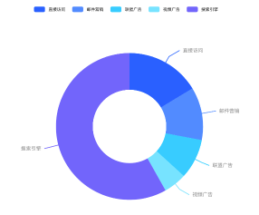

# 环状图Doughunt

## 一、效果总览

<div style="display: flex; gap: 30px; justify-content: flex-start;">
    
    
</div>

## 二、描述
环形图或饼图

## 使用场景
1. 饼图主要包括图形、标签、图例等内容
2. 展现部分与部分之间，以及部分与整体的关系
3. 部分相加之和等于整体的 100%，用整圆表示

## 三、构造函数及参数说明
```typescript
@Component
export struct OmniPieChart {
  private drawViewModel?: DrawBaseViewModel<PieDataType>
  @Prop @Watch('onCountUpdated') options: Options<PieDataType>;
  @State chartOption: OptionInterface<PieDataType> = {}
  @State renderType: string = 'init'
  private click: Function = (event: InterfaceObj, params: InterfaceObj) => {
  }
  tooltipClick: Function = (event: InterfaceObj, params: InterfaceObj) => {
  }
  
  @BuilderParam customTooltip: (tooltipInfo: InterfaceObj) => void = globalBuilder
}  
```

### OmniPieChart

| 参数名               | 参数类型                               | 描述                          | 是否必填 | 默认值      |
|-------------------|------------------------------------|-----------------------------|------|----------|
| options       |  Options                  | 环状图的数据和样式     | 否    |  null   |
| click        | Function                         | 图表点击事件的回调 | 否    | 空实现   |
| drawViewModel       | DrawBaseViewModel            | 折线图绘制逻辑类 | 否    | new DrawPieViewModel()   |
| customTooltip       | Function            | 自定义tooltip时的点击回调 | 否    | 图表库自动生成默认值   |

## 四、代码演示
```typescript
@Component
export struct OmniPieChartExamplePage {
  @State defOption: Options<PieDataType> = new Options({
    series:[
      {
        name:'最高气温',
        data: [
          {value:435, name:'直接访问'},
          {value:310, name:'邮件营销'},
          {value:234, name:'联盟广告'},
          {value:135, name:'视频广告'},
          {value:1548, name:'搜索引擎'}
        ]
      }
    ]
  })
  build() {
    NavDestination() {
      Column(){
        OmniPieChart({
          options: this.defOption
        })
      }
      .height('50%')
    }
    .title("环状图示例")
  }
}
```