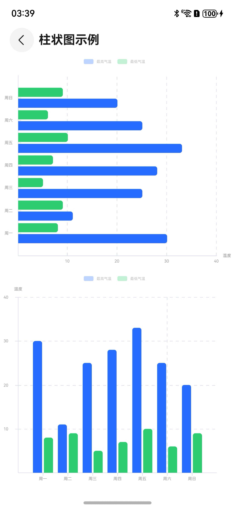

# 柱状图ProgressBar

## 一、效果总览



## 二、描述

- 数据条形柱状图。

## 三、构造函数及参数说明

### OmniProgressBarChart

| 参数名           | 参数类型          | 描述                              | 是否必填 | 默认值      |
|---------------|---------------|---------------------------------|------|----------|
| barChartStyle | BarChartStyle | 柱状图样式，纵向：vertical，横向：horizontal | 否    | vertical |
| options       | Options       | 柱状图参数                           | 是    | 无        |

### Options

| 参数名    | 参数类型                          | 描述   | 是否必填 | 默认值 |
|--------|-------------------------------|------|------|-----|
| xAxis  | AxisInterface                 | x坐标轴 | 是    | 无   |
| yAxis  | AxisInterface                 | y坐标轴 | 是    | 无   |
| series | Array\<SeriesInterface\<T\>\> | 图表数据 | 是    | 无   |

### AxisInterface

| 参数名  | 参数类型                      | 描述    | 是否必填 | 默认值 |
|------|---------------------------|-------|------|-----|
| type | string                    | 类型    | 是    | 无   |
| data | Array\<string \| number\> | 坐标轴数据 | 是    | 无   |

### SeriesInterface

| 参数名      | 参数类型     | 描述    | 是否必填 | 默认值  |
|----------|----------|-------|------|------|
| name     | string   | 数据名称  | 是    | 无    |
| color    | string   | 柱状条颜色 | 否    | 内置颜色 |
| barStyle | BarStyle | 柱状条样式 | 否    | 内置样式 |
| data     | T[]      | 柱状条数据 | 是    | 无    |

### BarStyle

| 参数名    | 参数类型   | 描述    | 是否必填 | 默认值 |
|--------|--------|-------|------|-----|
| width  | number | 柱状条宽度 | 否    | 15  |
| radius | number | 柱状条圆角 | 否    | 4   |
| gap    | number | 柱状条间距 | 否    | 3   |

## 四、代码演示

```typescript
@Component
export struct OmniProgressBarChartExamplePage {
  @State defOption: Options<number> = new Options({
    xAxis: {
      type: 'value',
      data: ['周一', '周二', '周三', '周四', '周五', '周六', '周日'],
    },
    yAxis: {
      type: 'category',
      name: '温度'
    },
    series: [
      {
        name: '最高气温',
        barStyle: {
          width: 15,
        },
        color: '#296DFF',
        data: [30, 11, 25, 28, 33, 25, 20]
      },
      {
        name: '最低气温',
        barStyle: {
          width: 15,
        },
        color: '#2ECC71',
        data: [8, 9, 5, 7, 10, 6, 9]
      },
    ],
  })

  build() {
    NavDestination() {
      Column() {
        Column() {
          OmniProgressBarChart({
            barChartStyle: BarChartStyle.horizontal,
            options: this.defOption
          })
        }
        .height('50%')

        Column() {
          OmniProgressBarChart({
            options: this.defOption
          })
        }
        .height('50%')
      }
    }
    .title("柱状图示例")
      .height('100%')
  }
}
```