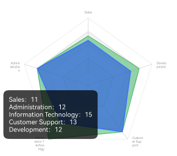

# 雷达图Radar

## 一、效果总览

<div style="display: flex; gap: 30px; justify-content: flex-start;">
    
    
</div>

## 二、描述
### 使用场景
1. 需要比较一组数据再多个维度上综合优势（看雷达图总面积）的场景
2. 需要比较一组数据中再某个维度上个别优势的场景（看某个维度上各个项目的位置）

## 三、构造函数及参数说明

```typescript
@Component
export struct OmniRadarChart {
  private drawViewModel?: DrawBaseViewModel<RadarDataType>
  @Prop @Watch('onCountUpdated') options: Options<RadarDataType>;
  @State chartOption: OptionInterface<RadarDataType> = {};
  @State renderType: string = 'init'
  private click: Function = (event: InterfaceObj, params: InterfaceObj) => {
  }
  private tooltipClick: Function = (event: InterfaceObj, params: InterfaceObj) => {
  }
  @BuilderParam customTooltip: (tooltipInfo: InterfaceObj) => void = globalBuilder
}
```

### OmniRadarChart

| 参数名               | 参数类型                               | 描述                          | 是否必填 | 默认值      |
|-------------------|------------------------------------|-----------------------------|------|----------|
| options       |  Options                  | 环状图的数据和样式     | 否    |  null   |
| click        | Function                         | 图表点击事件的回调 | 否    | 空实现   |
| drawViewModel       | DrawBaseViewModel            | 折线图绘制逻辑类 | 否    | new DrawRadarViewModel()   |
| customTooltip       | Function            | 自定义tooltip时的点击回调 | 否    | 图表库自动生成默认值   |

## 四、代码演示
```typescript
@Component
export struct OmniRadarChartExamplePage {
  @State defOption: Options<number> = new Options({
    radar: {
      indicator: [
        { name: 'Sales' },
        { name: 'Administration' },
        { name: 'Information Technology' },
        { name: 'Customer Support' },
        { name: 'Development' }
      ]
    },
    series: [
      {
        name: '最高气温',
        lineStyle: {
          width: 1.5,
          color: "#ff52be80"
        },
        areaStyle: {
          color: {
            direction: [0, 1, 0, 0],
            colors: [
              '#9952be80'
            ]
          }
        },
        data: [11, 12, 15, 13, 12],
      },
      {
        name: '最高气温2',
        areaStyle: {
          color: {
            direction: [0, 1, 0, 0],
            colors: [
              '#99265fe5'
            ]
          }
        },
        data: [10, 12, 10.5, 13, 10]
      },
    ]
  })
  build() {
    NavDestination() {
      Column(){
        OmniRadarChart({
          options: this.defOption
        })
      }
      .height('50%')
    }
    .title("雷达图示例")
  }
}
```
