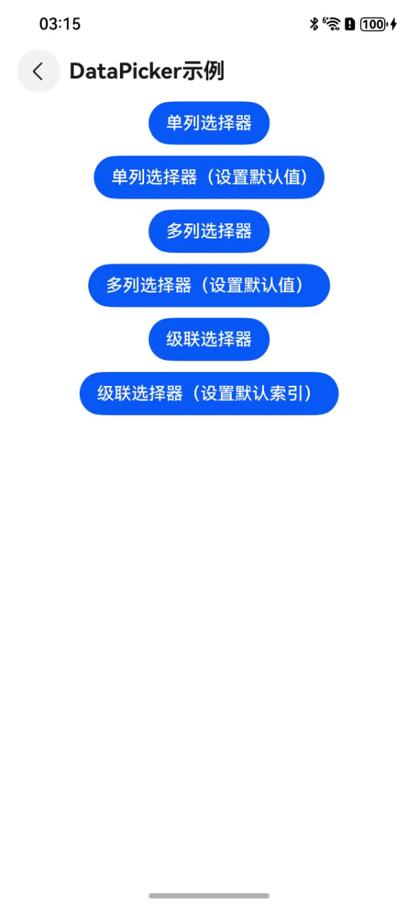
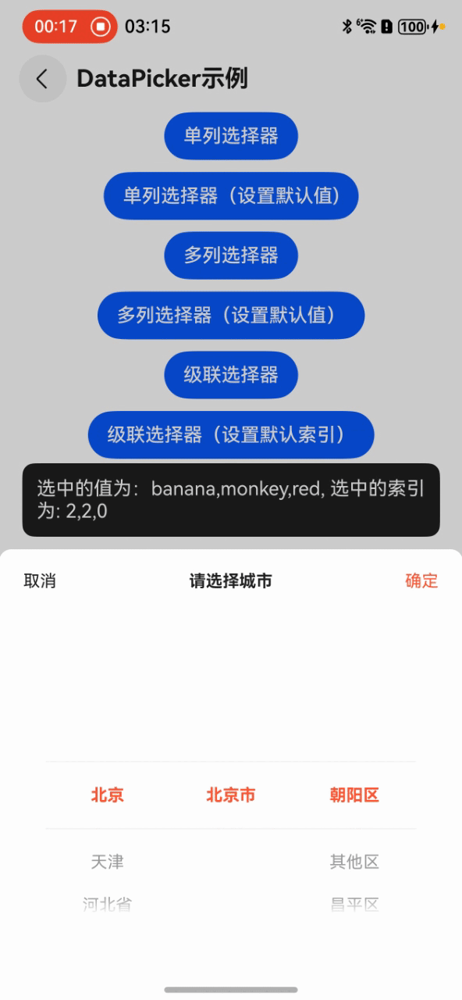

# 单选/多选选择器DataPicker

## 一、效果总览



## 二、描述

底部弹出的数据选择器，支持单选、多选和级联多选

## 三、构造函数及参数说明

```text
DataPicker.getInstance(uiContext: UIContext).show(options: PickerOptions)

interface PickerOptions {
  range: string[] | string[][] | TextCascadePickerRangeContentWrapper[]
  selected?: number | number[]
  theme?: PickerTheme
  canLoop?: boolean
  confirmText?: string | Resource
  cancelText?: string | Resource
  title?: string | Resource
  onConfirm?: (v: string | string[], i: number | number[]) => void
  onCancel?: (v: string | string[], i: number | number[]) => void
}

interface PickerTheme {
  divider?: DividerOptions
  textStyle?: PickerTextStyle
  selectedTextStyle?: PickerTextStyle
  confirmBtnStyle?: TextStyle
  cancelBtnStyle?: TextStyle
  titleTextStyle?: TextStyle
}
```

### PickerOptions

| 参数名         | 类型                                                               | 必填 | 说明               |
|:------------|:-----------------------------------------------------------------|:---|:-----------------|
| range       | string[] \| string[][] \| TextCascadePickerRangeContentWrapper[] | 是  | 选择器的数据选择列表       |
| selected    | number \| number[]                                               | 否  | 设置默认选中项在数组中的索引值。 |
| theme       | PickerTheme                                                      | 否  | 设置选择器的样式         |
| canLoop     | boolean                                                          | 否  | 设置是否可循环滚动        |
| confirmText | string \| Resource                                               | 否  | 设置确认按钮文本         |
| cancelText  | string \| Resource                                               | 否  | 设置取消按钮文本         |
| title       | string \| Resource                                               | 否  | 设置标题文本           |
| onConfirm   | (v: string \| string[], i: number \| number[]) => void           | 否  | 设置确认按钮点击回调函数     |
| onCancel    | (v: string \| string[], i: number \| number[]) => void           | 否  | 设置取消按钮点击回调函数     |

### PickerTheme

| 参数名               | 类型              | 必填 | 说明                             |
|:------------------|:----------------|:---|:-------------------------------|
| divider           | DividerOptions  | 否  | 设置分割线的样式                       |
| textStyle         | PickerTextStyle | 否  | 设置未选中文字的文本颜色、字号、字体粗细           |
| selectedTextStyle | PickerTextStyle | 否  | 设置选中文字的文本颜色、字号、字体粗细            |
| confirmBtnStyle   | TextStyle       | 否  | 设置确认按键的文字样式，包括文本颜色、字号、粗细、风格和列表 |

## 四、代码演示

### 示例一：单选


```text
@Entry
@Component
struct DataPickerExample {
  @State private alphabet: string[] =
    ['a', 'b', 'c', 'd', 'e', 'f', 'g', 'h', 'i', 'j', 'k', 'l', 'm', 'o', 'p', 'q', 'r', 's', 't', 'u',
      'w', 'x', 'y', 'z']
    
  build() {
    Column() {
      Button('单列选择器')
          .onClick(() => {
            DataPicker.getInstance(this.getUIContext()).show({
              range: this.alphabet,
              title: '请选择一个字母',
              onConfirm: (v, i) => {
                Toast.showText({ msg: '选中的值为：' + v + ', 选中的索引为: ' + i })
              },
              onCancel: () => {
                Toast.showText({ msg: '点击取消按钮' })
              }
            })
          })
    }
  }  
}
```

### 示例二：多选


```text
@Entry
@Component
struct DataPickerExample {
  private fruits: string[] = ['apple', 'orange', 'banana', 'peach', 'pineapple']
  private animals: string[] = ['ant', 'elephant', 'monkey', 'panda', 'cat', 'mouse']
  private colors: string[] = ['red', 'black', 'blue', 'pink', 'yellow']
  @State private multi: string[][] = [this.fruits, this.animals, this.colors]
    
  build() {
    Column() {
      Button('多列选择器')
          .onClick(() => {
            DataPicker.getInstance(this.getUIContext()).show({
              range: this.multi,
              title: '请选择你最喜欢的水果、动物和颜色',
              onConfirm: (v, i) => {
                Toast.showText({ msg: '选中的值为：' + v + ', 选中的索引为: ' + i })
              },
              onCancel: () => {
                Toast.showText({ msg: '点击取消按钮' })
              }
            })
          })
    }
  }  
}
```

### 示例三：级联多选



```text
@Entry
@Component
struct DataPickerExample {
  @State private cascade: TextCascadePickerRangeContentWrapper[] = [
    new TextCascadePickerRangeContentWrapper('北京',
      [new TextCascadePickerRangeContentWrapper('北京市', [
        new TextCascadePickerRangeContentWrapper('朝阳区'),
        new TextCascadePickerRangeContentWrapper('其他区'),
        new TextCascadePickerRangeContentWrapper('昌平区'),
        new TextCascadePickerRangeContentWrapper('大兴区'),
        new TextCascadePickerRangeContentWrapper('东城区'),
        new TextCascadePickerRangeContentWrapper('房山区'),
        new TextCascadePickerRangeContentWrapper('丰台区'),
        new TextCascadePickerRangeContentWrapper('海淀区'),
        new TextCascadePickerRangeContentWrapper('怀柔区'),
        new TextCascadePickerRangeContentWrapper('门头沟区'),
        new TextCascadePickerRangeContentWrapper('密云区'),
        new TextCascadePickerRangeContentWrapper('平谷区'),
        new TextCascadePickerRangeContentWrapper('石景山区'),
        new TextCascadePickerRangeContentWrapper('顺义区'),
        new TextCascadePickerRangeContentWrapper('通州区'),
        new TextCascadePickerRangeContentWrapper('西城区'),
        new TextCascadePickerRangeContentWrapper('延庆区'),
      ])]),
    new TextCascadePickerRangeContentWrapper('天津',
      [new TextCascadePickerRangeContentWrapper('天津市', [
        new TextCascadePickerRangeContentWrapper('宝坻区'),
        new TextCascadePickerRangeContentWrapper('北辰区'),
        new TextCascadePickerRangeContentWrapper('滨海新区'),
        new TextCascadePickerRangeContentWrapper('东丽区'),
        new TextCascadePickerRangeContentWrapper('河北区'),
        new TextCascadePickerRangeContentWrapper('河东区'),
        new TextCascadePickerRangeContentWrapper('和平区'),
        new TextCascadePickerRangeContentWrapper('河西区'),
        new TextCascadePickerRangeContentWrapper('红桥区'),
        new TextCascadePickerRangeContentWrapper('蓟州区'),
        new TextCascadePickerRangeContentWrapper('津南区'),
        new TextCascadePickerRangeContentWrapper('静海区'),
        new TextCascadePickerRangeContentWrapper('南开区'),
        new TextCascadePickerRangeContentWrapper('宁河区'),
        new TextCascadePickerRangeContentWrapper('其他区'),
        new TextCascadePickerRangeContentWrapper('武清区'),
        new TextCascadePickerRangeContentWrapper('西青区'),
      ])]),
    new TextCascadePickerRangeContentWrapper('河北省',
      [new TextCascadePickerRangeContentWrapper('保定市', [
        new TextCascadePickerRangeContentWrapper('安国市'),
        new TextCascadePickerRangeContentWrapper('安新县'),
        new TextCascadePickerRangeContentWrapper('博野县'),
      ]),
        new TextCascadePickerRangeContentWrapper('沧州市', [
          new TextCascadePickerRangeContentWrapper('沧县'),
          new TextCascadePickerRangeContentWrapper('东关县'),
          new TextCascadePickerRangeContentWrapper('海兴县'),
        ])]),
  ]
    
  build() {
    Column() {
      Button('级联选择器')
          .onClick(() => {
            DataPicker.getInstance(this.getUIContext()).show({
              range: this.cascade,
              title: '请选择城市',
              onConfirm: (v, i) => {
                Toast.showText({ msg: '选中的值为：' + v + ', 选中的索引为: ' + i })
              },
              onCancel: () => {
                Toast.showText({ msg: '点击取消按钮' })
              }
            })
          })
    }
  }  
}
```