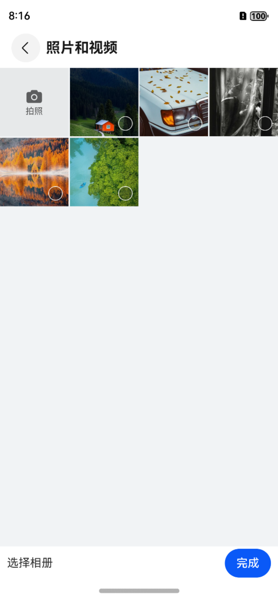

# 图片选择ImagePicker

## 一、效果总览


<div style="display: flex; gap: 30px; justify-content: flex-start;">
 
 
</div>

## 二、描述
1. 提供系统图片选择功能，包括触发器组件和图片选择组件,并提供相关的自定义属性和图片结果回调
2. 图片选择组件根据系统组件进行了一定程度的封装

## 三、构造函数及参数说明
```typescript
@Component
export struct OmniImagePickerTrigger {

  @Prop triggerImageIcon: ResourceStr
  @Link selectUris: Array<ResourceStr>
  @Require goImagePicker?: () => void
}  
```
### OmniImagePickerTrigger

| 参数名     | 参数类型          | 描述            | 是否必填 | 默认值       |
|---------|---------------|---------------|------|-----------|
| triggerImageIcon | `ResourceStr` | 触发器图标 | 否 | `app.media.image_trigger_add` |
| selectUris | `ResourceStr[]` | 选中图片的数组 | 是 | `[]` |
| goImagePicker | `() => void` | 跳转图片选择页面的回调 | 是 | 无 |

```typescript
@Component
export struct OmniImagePicker {

  onFinished?: (result: Object) => void;

  goAlbumPicker?: () => void;
  // 组件初始化时设置参数信息
  pickerOptions: PickerOptions = new PickerOptions();

  // 组件初始化完成后，可控制组件部分行为
  @State pickerController: PickerController = new PickerController();

  // 已选择的图片
  @State selectUris: Array<string> = new Array<string>();

  //目前选择的图片
  @State currentUri: string = '';

  //是否显示大图
  @State isBrowserShow: boolean = true;

  @Prop
  @Watch('onAlbumInfoChang')
  currentAlbumUrl: string = ""
}
```

### OmniImagePicker
| 参数名     | 参数类型          | 描述            | 是否必填 | 默认值       |
|---------|---------------|---------------|------|-----------|
| currentAlbumUrl | `string` | 当前相册地址 | 否 |  "" |
| goAlbumPicker | `() => void` | 跳转相册选择页面的回调 | 是 | 无 |
| pickerOptions | `PickerOptions` | 图片选择组件配置项，同鸿蒙系统内置一致 | 否 | `new PickerOptions()` |
| isBrowserShow | `boolean` | 是否显示大图 | 否 | false |
| pickerController | `PickerController` | 图片选择控制器，同系统内置 | 否 | `new PickerController()` |


## 四、代码演示

代码执行效果同以上预览效果
### 触发器页面
```typescript
@Component
export struct OmniImagePickerExamplePage {
  @Consume('pathStack') pageStack: NavPathStack;
  @State selectUris: Array<string> = new Array<string>();

  build() {
    NavDestination() {
      OmniImagePickerTrigger({
        selectUris: $selectUris,
        goImagePicker: () => {
          this.pageStack.pushPathByName("OmniImagePickerSelectExamplePage", null, (data: PopInfo) => {
            if (data.result instanceof Array) {
              data.result.forEach((url: string) => {
                this.selectUris.push(url)
              })
            }
          }, true)
        }
      })
    }
    .title("图片选择器示例")
  }
}
```
### 图片选择页面
```typescript
@Component
export struct OmniImagePickerSelectExamplePage {
  @Consume('pathStack') pageStack: NavPathStack;

  @State currentAlbumUrl?: string = ""
  @State currentAlbumName?: string = "照片和视频"
  build() {
    NavDestination() {
      OmniImagePicker({
        currentAlbumUrl: this.currentAlbumUrl,
        onFinished: (result: Object) => {
          this.pageStack.pop(result)
        },
        goAlbumPicker: () => {
          this.pageStack.pushPathByName("OmniImageAlbumPickerPage", null, (popInfo: PopInfo) => {
            if (popInfo.result instanceof AlbumInfo) {
              this.currentAlbumUrl = popInfo.result.uri
              this.currentAlbumName = popInfo.result.albumName
            }
          }, true)
        }
      })
    }
    .title(this.currentAlbumName)
  }
}
```
### 相册选择页面
```typescript
@Component
export struct OmniImageAlbumPickerPage {
  @Consume('pathStack') pageStack: NavPathStack;

  albumOptions: AlbumPickerOptions = new AlbumPickerOptions();

  onAlbumInfoClick(albumInfo: AlbumInfo): boolean {
    this.pageStack.pop(albumInfo)
    return true
  }
  build() {
    NavDestination() {
      AlbumPickerComponent({
        albumPickerOptions: this.albumOptions,
        onAlbumClick: (albumInfo: AlbumInfo): boolean => this.onAlbumInfoClick?.(albumInfo) ?? false
      })
    }
    .title("相册选择")
  }

  aboutToAppear(): void {
    this.albumOptions.themeColorMode = PickerColorMode.AUTO

  }
}
```