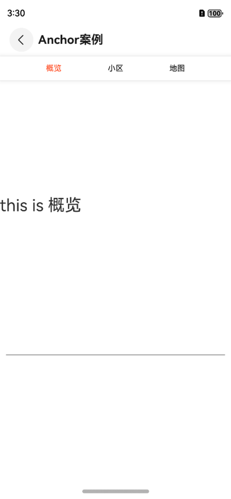
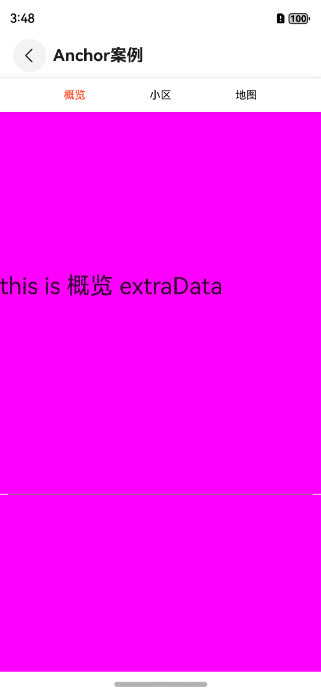

# 锚点Anchor

## 一、效果总览




## 二、描述

锚点定位，常位于长列表，用于快速定位到指定位置或者模块

## 三、构造函数及参数说明

```typescript
OmniAnchor({
  @Require listDataWithAnchor: ListDataModel[],
  selectedAnchorTextModifier : AnchorTextModifier,
  unSelectedAnchorTextModifier : AnchorTextModifier,
  anchorBarModifier: AnchorBarModifier,
  indicatorModifier:AnchorIndicatorModifier,
  listBuilder: ($$: ListDataModel[]) => void
})
```

| 参数名                          | 参数类型                          | 描述                   | 是否必填 | 默认值                       |
|------------------------------|-------------------------------|----------------------|------|---------------------------|
| listDataWithAnchor           | ListDataModel[]               | 带锚点的列表数据             | 是    | []                        |
| listBuilder                  | ($$: ListDataModel[]) => void | 列表item构造器            | 是    |                           |
| selectedAnchorTextModifier   | AnchorTextModifier            | 选中时样式modifier        | 否    | AnchorTextModifier()      |
| unSelectedAnchorTextModifier | AnchorTextModifier            | 未选中时样式modifier       | 否    | AnchorTextModifier()      |
| anchorBarModifier            | AnchorBarModifier             | 锚点导航栏样式modifier      | 否    | AnchorBarModifier()       |
| indicatorModifier            | AnchorIndicatorModifier       | 锚点导航栏文本底部指示器modifier | 否    | AnchorIndicatorModifier() |

## 四、代码演示

### 效果1：默认效果


默认效果只需要传入数据以及自定义构造列表即可
```typescript
@Builder
itemListBuilder(listData: ListDataModel[]) {
  ForEach(listData, (item: ListDataModel) => {
    ListItem() {
      Text(`this is ${item.title} ${(item as RealListDataWithAnchor).extraData ?? ""}`)
        .height(500)
        .width('100%')
        .fontSize(28)
        .backgroundColor((item as RealListDataWithAnchor).backgroundColor ?? Color.Transparent)
    }
  })
}

OmniAnchor({
    listDataWithAnchor: this.mockListData,
    listBuilder: this.itemListBuilder
  })
```

### 效果2：自定义选中样式


自定义选中和不选中样式则需要传入**selectedAnchorTextModifier**和**unSelectedAnchorTextModifier**
```typescript
@Builder
itemListBuilder(listData: ListDataModel[]) {
  ForEach(listData, (item: ListDataModel) => {
    ListItem() {
      Text(`this is ${item.title} ${(item as RealListDataWithAnchor).extraData ?? ""}`)
        .height(500)
        .width('100%')
        .fontSize(28)
        .backgroundColor((item as RealListDataWithAnchor).backgroundColor ?? Color.Transparent)
    }
  })
}

OmniAnchor({
    selectedAnchorTextModifier: new AnchorTextModifier()
      .withFontWeight(FontWeight.Medium)
      .withFontColor('#00ff00'),
    unSelectedAnchorTextModifier: new AnchorTextModifier(),
    anchorBarModifier: new AnchorBarModifier(),
    listDataWithAnchor: this.mockListData,
    listBuilder: this.itemListBuilder
  })
```

### 效果3：自定义锚点导航栏样式
#### 均分


```typescript
anchorBarModifier:new AnchorBarModifier().withJustifyContent(FlexAlign.SpaceAround)
```

#### 居中



```typescript
anchorBarModifier:new AnchorBarModifier().withJustifyContent(FlexAlign.SpaceEvenly)
```


#### 撑满剩余空间


```typescript
anchorBarModifier:new AnchorBarModifier().withJustifyContent(FlexAlign.SpaceBetween)
```