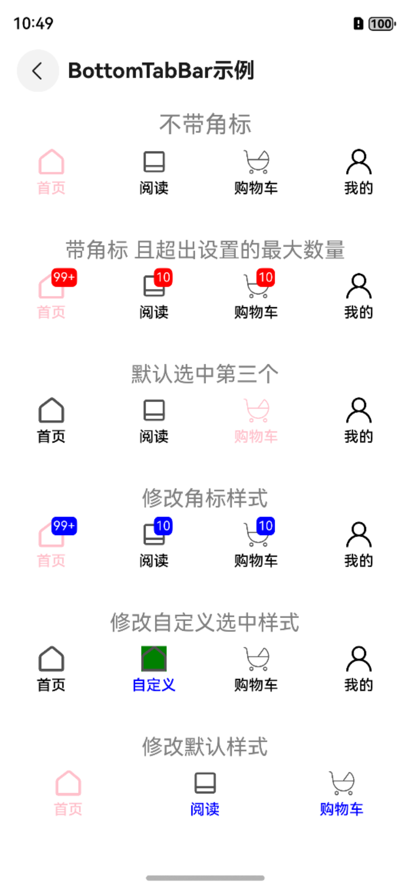

# 底部导航BottomBar

## 一、效果总览

<div style="display: flex; justify-content: space-between;">
 
</div>

## 二、描述

一般用于首页 或功能模块底部

## 三、构造函数及参数说明

| 参数名                  | 参数类型                    | 描述              | 是否必填 | 默认值 | 
|----------------------|-------------------------|-----------------|------|-----|
| data                 | Array[OmniBottomBarItem]  | 导航栏数据           | 是    | 无   |
| defaultSelectedIndex | number                  | 默认选中下标          | 否    | 0   |
| textModifier         | BarTextModifier         | 非选中态下text的样式修改器 | 否    | 见下方 |
| textSelectedModifier | BarSelectTextModifier   | 选中态下text的样式修改器  | 否    | 见下方 |
| badgeTextModifier    | BarBadgeTextModifier    | badge的样式修改器     | 否    | 见下方 |
| iconModifier         | BarIconModifier         | 非选中态下icon的样式修改器 | 否    | 见下方 |
| iconSelectedModifier | BarSelectedIconModifier | 选中态下icon的样式修改器  | 否    | 见下方 |

### OmniBottomBarItem

| 参数名          | 参数类型               | 描述       | 是否必填 | 默认值 | 说明         |      
|--------------|--------------------|----------|------|-----|------------|
| text         | string             | 底部导航项文本  | 是    | -   | -          |
| selectedText | string             | 选中时导航项文本 | 否    | -   | 未设置时使用text |
| icon         | string \| Resource | 未选中状态图标  | 是    | -   |            |
| selectedIcon | string \| Resource | 选中状态图标   | 否    | -   | 未设置时使用icon |
| badgeNo      | number             | 角标红点数    | 否    | -   | -          |
| maxBadgeNo   | number             | 角标红点最大数  | 否    | 99  | -          |
| action       | ()=> void          | 点击回调     | 否    |     | -          |

### BarTextModifier

| 参数名        | 参数类型   | 描述   | 是否必填 | 默认值     |
|------------|--------|------|------|---------|
| fontSize   | number | 文字大小 | 否    | 10      |
| fontColor  | Color  | 文字颜色 | 否    | #999999 |
| fontWeight | number | 文字粗细 | 否    | 400     |

### BarSelectTextModifier

| 参数名        | 参数类型   | 描述       | 是否必填 | 默认值     |
|------------|--------|----------|------|---------|
| fontSize   | number | 选中状态文字大小 | 否    | 10      |
| fontColor  | Color  | 选中状态文字颜色 | 否    | #333333 |
| fontWeight | number | 选中状态文字粗细 | 否    | 400     |

### BarBadgeTextModifier

| 参数名             | 参数类型   | 描述     | 是否必填 | 默认值     |
|-----------------|--------|--------|------|---------|
| fontSize        | number | 徽标文字大小 | 否    | 12      |
| fontColor       | Color  | 徽标文字颜色 | 否    | #FFFFFF |
| backgroundColor | Color  | 徽标背景颜色 | 否    | #FF0000 |
| borderRadius    | number | 徽标圆角大小 | 否    | 7       |

### BarIconModifier

| 参数名    | 参数类型   | 描述     | 是否必填 | 默认值 |
|--------|--------|--------|------|-----|
| width  | number | 选中图标宽度 | 否    | 25  |
| height | number | 选中图标高度 | 否    | 25  |

### BarSelectedIconModifier

| 参数名             | 参数类型   | 描述      | 是否必填 | 默认值         |
|-----------------|--------|---------|------|-------------|
| width           | number | 选中图标宽度  | 否    | 25          |
| height          | number | 选中图标高度  | 否    | 25          |
| backgroundColor | Color  | 选中图标背景色 | 否    | transparent |

## 四、代码演示

```typescript
OmniBottomTabBar({
  data: this.barItem,
  defaultSelectedIndex: 1,
  textModifier: new BarTextModifier().withFontColor(Color.Blue),
  textSelectedModifier: new BarSelectTextModifier().withFontColor(Color.Blue),
  iconSelectedModifier: new BarSelectedIconModifier().withBackgroundColor(Color.Green),
  iconModifier: new BarIconModifier().withHeight(20),
  badgeTextModifier: new BarBadgeTextModifier().withBackgroundColor(Color.Blue)
}).margin({ top: 10 })
```
