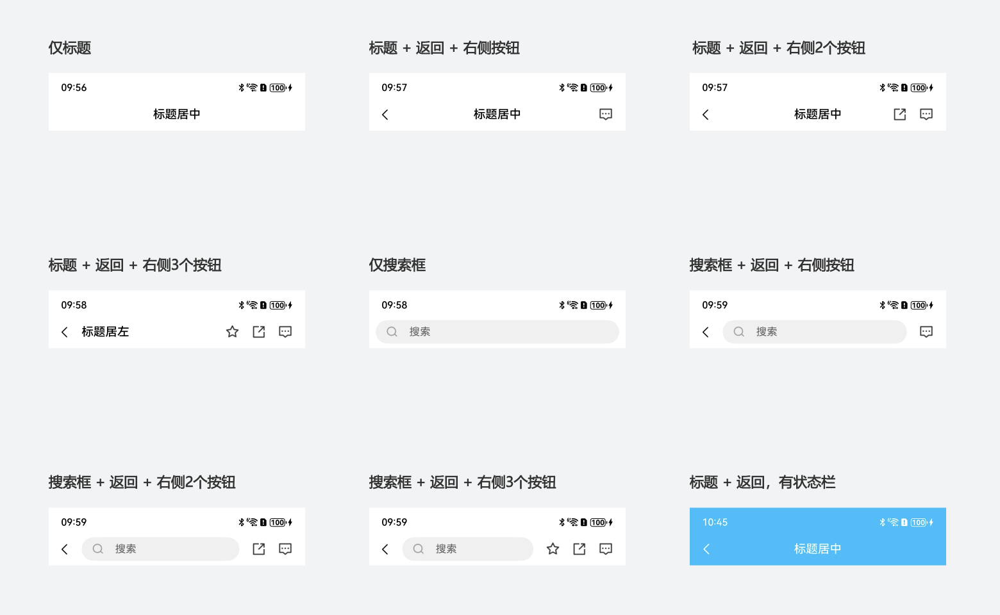

# 导航栏NavigationBar

## 一、效果总览



## 二、描述

页面顶部的导航栏。

## 三、构造函数及参数说明

### OmniNavigationBar

| 参数名               | 参数类型                                                   | 描述       | 是否必填 | 默认值               |
|-------------------|--------------------------------------------------------|----------|------|-------------------|
| isShowStatusBar   | boolean                                                | 是否显示状态栏  | 否    | false             |
| navHeight         | number                                                 | 导航栏高度    | 否    | 50                |
| bgColor           | string                                                 | 背景色      | 否    | #FFFFFF           |
| title             | ResourceStr                                            | 标题       | 否    | 无                 |
| titleFontSize     | number \| string \| Resource                           | 标题字体大小   | 否    | 主题fontSizeLg，16   |
| titleFontWeight   | number \| FontWeight \| string                         | 标题粗细体    | 否    | FontWeight.Medium |
| titleFontColor    | ResourceColor                                          | 标题字体颜色   | 否    | #000000           |
| titleIsCenter     | boolean                                                | 标题是否居中   | 否    | true              |
| hideBackButton    | boolean                                                | 是否隐藏返回按钮 | 否    | false             |
| backButtonIcon    | ResourceStr                                            | 返回按钮图标   | 否    | back              |
| backButtonIcon    | ResourceStr                                            | 返回按钮图标   | 否    | back              |
| searchPlaceholder | ResourceStr                                            | 搜索框文本占位符 | 否    | 搜索                |
| searchInputType   | InputType                                              | 搜索输入框类型  | 否    | InputType.Normal  |
| searchImage       | ResourceStr                                            | 搜索图标     | 否    | search            |
| backClick         | (event?: ClickEvent) => void                           | 返回点击     | 否    | 无                 |
| searchClick       | (event?: ClickEvent) => void                           | 搜索框点击    | 否    | 无                 |
| searchClick       | (event?: ClickEvent) => void                           | 搜索框点击    | 否    | 无                 |
| onSubmit          | (enterKey?: EnterKeyType, event?: SubmitEvent) => void | 输入提交回调   | 否    | 无                 |
| onTextChange      | (value: string) => void                                | 输入内容变化回调 | 否    | 无                 |
| onEditChange      | (isEditing: boolean) => void                           | 输入状态变化回调 | 否    | 无                 |
| rightMenus        | OmniMenuItem[]                                         | 右侧功能按钮   | 否    | 无                 |

### OmniMenuItem

| 参数名    | 参数类型                  | 描述   | 是否必填 | 默认值 |
|--------|-----------------------|------|------|-----|
| image  | string \| ResourceStr | 按钮图标 | 是    | 无   |
| action | () => void            | 按钮点击 | 否    | 无   |

## 四、代码演示

```typescript
Text('样式一：仅标题').fontColor(Color.Gray).fontSize(16)
  .alignSelf(ItemAlign.Start)
  .padding({
    left: 15,
    right: 15,
    top: 10,
    bottom: 10
  })
OmniNavigationBar({
  bgColor: Color.White,
  hideBackButton: true,
  title: '标题居中',
  titleFontSize: '18vp'
})

Text('样式二：标题 + 返回 + 右侧按钮')
  .fontColor(Color.Gray)
  .fontSize(16)
  .alignSelf(ItemAlign.Start)
  .margin({ top: 25 })
  .padding({
    left: 15,
    right: 15,
    top: 10,
    bottom: 10
  })
OmniNavigationBar({
  title: '标题居中',
  titleFontSize: '18vp',
  rightMenus: [
    {
      image: 'https://pic6.58cdn.com.cn/nowater/frs/n_v3b4f2c5f26ceb4c01998907afeaedb34d.webp',
      action: () => {
        Toast.showText({ msg: '点击按钮1' })
      }
    }
  ]
})

Blank().height(10)
OmniNavigationBar({
  title: '标题居中',
  titleFontSize: '18vp',
  backClick: () => {
  },
  rightMenus: [
    {
      image: 'https://pic4.58cdn.com.cn/nowater/frs/n_v3ba2b2c34ade04bfcba4ae805e1769cbb.webp',
      action: () => {
        Toast.showText({ msg: '点击按钮1' })
      }
    },
    {
      image: 'https://pic6.58cdn.com.cn/nowater/frs/n_v3b4f2c5f26ceb4c01998907afeaedb34d.webp',
      action: () => {
        Toast.showText({ msg: '点击按钮2' })
      }
    }
  ]
})

Blank().height(10)
OmniNavigationBar({
  title: '标题居左',
  titleIsCenter: false,
  titleFontSize: '18vp',
  backClick: () => {
  },
  rightMenus: [
    {
      image: 'https://pic6.58cdn.com.cn/nowater/frs/n_v35691dfb4777f4fed9455fdc35f301210.webp',
      action: () => {
        Toast.showText({ msg: '点击按钮1' })
      }
    },
    {
      image: 'https://pic4.58cdn.com.cn/nowater/frs/n_v3ba2b2c34ade04bfcba4ae805e1769cbb.webp',
      action: () => {
        Toast.showText({ msg: '点击按钮2' })
      }
    },
    {
      image: 'https://pic6.58cdn.com.cn/nowater/frs/n_v3b4f2c5f26ceb4c01998907afeaedb34d.webp',
      action: () => {
        Toast.showText({ msg: '点击按钮3' })
      }
    }
  ]
})

Text('样式三：搜索框')
  .fontColor(Color.Gray)
  .fontSize(16)
  .alignSelf(ItemAlign.Start)
  .margin({ top: 25 })
  .padding({
    left: 15,
    right: 15,
    top: 10,
    bottom: 10
  })
OmniNavigationBar({
  hideBackButton: true,
  searchPlaceholder: '搜索',
  searchClick: () => {
    console.log('点击搜索框')
  },
})

Text('样式四：搜索框 + 返回 + 右侧按钮')
  .fontColor(Color.Gray)
  .fontSize(16)
  .alignSelf(ItemAlign.Start)
  .margin({ top: 25 })
  .padding({
    left: 15,
    right: 15,
    top: 10,
    bottom: 10
  })
OmniNavigationBar({
  searchPlaceholder: '搜索',
  searchClick: () => {
    console.log('搜索框')
  },
  backClick: () => {
  },
  rightMenus: [
    {
      image: 'https://pic6.58cdn.com.cn/nowater/frs/n_v3b4f2c5f26ceb4c01998907afeaedb34d.webp',
      action: () => {
        Toast.showText({ msg: '点击按钮1' })
      }
    }
  ]
})

Blank().height(10)
OmniNavigationBar({
  searchPlaceholder: '搜索',
  searchClick: () => {
    console.log('搜索框')
  },
  backClick: () => {
  },
  rightMenus: [
    {
      image: 'https://pic4.58cdn.com.cn/nowater/frs/n_v3ba2b2c34ade04bfcba4ae805e1769cbb.webp',
      action: () => {
        Toast.showText({ msg: '点击按钮1' })
      }
    },
    {
      image: 'https://pic6.58cdn.com.cn/nowater/frs/n_v3b4f2c5f26ceb4c01998907afeaedb34d.webp',
      action: () => {
        Toast.showText({ msg: '点击按钮2' })
      }
    }
  ]
})

Blank().height(10)
OmniNavigationBar({
  searchPlaceholder: '搜索',
  searchClick: () => {
    console.log('搜索框')
  },
  backClick: () => {
  },
  rightMenus: [
    {
      image: 'https://pic6.58cdn.com.cn/nowater/frs/n_v35691dfb4777f4fed9455fdc35f301210.webp',
      action: () => {
        Toast.showText({ msg: '点击按钮1' })
      }
    },
    {
      image: 'https://pic4.58cdn.com.cn/nowater/frs/n_v3ba2b2c34ade04bfcba4ae805e1769cbb.webp',
      action: () => {
        Toast.showText({ msg: '点击按钮2' })
      }
    },
    {
      image: 'https://pic6.58cdn.com.cn/nowater/frs/n_v3b4f2c5f26ceb4c01998907afeaedb34d.webp',
      action: () => {
        Toast.showText({ msg: '点击按钮3' })
      }
    }
  ]
})

Text('样式五：标题 + 返回，有状态栏')
  .fontColor(Color.Gray)
  .fontSize(16)
  .alignSelf(ItemAlign.Start)
  .margin({ top: 25 })
  .padding({
    left: 15,
    right: 15,
    top: 10,
    bottom: 10
  })
OmniNavigationBar({
  isShowStatusBar: true,
  bgColor: '#00BFFF',
  title: '标题居中',
  titleFontColor: '#FFFFFF',
  backButtonIconLeftMargin: 16,
  backButtonIcon: $r('app.media.ic_back_white'),
  backButtonIconSize: 18,
  titleFontSize: 18,
})
```