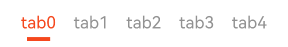

# 选项卡Tabs

## 一、效果总览
<div style="display: flex; gap: 30px; justify-content: flex-start;">
    
    
</div>

## 二、描述
1. 支持固定宽度和滑动两种样式，如基础效果战术
2. 支持Tab item的文字、左右图片、红点以及Badge的配置
3. 支持指示器样式的设置
4. 支持切换tab时的指示器滑动动画
5. 滑动模式下切换tab时内容会随动滚动

## 三、构造函数及参数说明
### OmniTabs
| 参数名               | 参数类型                               | 描述                          | 是否必填 | 默认值      |
|-------------------|------------------------------------|-----------------------------|------|----------|
| tabs       |  OmniTabItemConfig[]             | tabs的内容以及item样式     | 否    |  []   |
| tabConfig        | OmniTabConfig              | tabs组件配置 | 是   |  需主动创建  |
| tabController       | OmniTabController            | 控制tabs组件逻辑 | 否    | 需主动创建   |


### OmniTabConfig
| **属性名**                   | **类型**                       | **描述**                                          |
|----------------------------|------------------------------|------------------------------------------------|
| `mode`                      | `OmniTabMode` (可选)            | tabs 组件的模式，例如：`OmniTabMode.Scrollable`、`OmniTabMode.Fixed` 等，默认为滚动模式          |
| `tabWidth`                  | `number` (可选)               | tab 的宽度。                                         |
| `tabHeight`                 | `number` (可选)               | tab 的高度。                                         |
| `indicatorColor`            | `ResourceColor` (可选)        | 指示器的颜色。                                       |
| `indicatorWidth`            | `number` (可选)               | 指示器的宽度。                                       |
| `indicatorHeight`           | `number` (可选)               | 指示器的高度。                                       |
| `labelColor`                | `ResourceColor` (可选)        | 标签文本的颜色。                                      |
| `labelTextStyle`            | `Font` (可选)                 | 标签文本的样式。                                      |
| `hasDivider`                | `boolean` (可选)              | 是否显示分隔线。                                      |
| `tabSpacing`                | `number` (可选)               | tab 间距，`scrollable` 模式下生效。                   |
| `badgeBackgroundColor`     | `ResourceColor` (可选)        | badge 背景的颜色。                                    |
| `badgeTextColor`            | `ResourceColor` (可选)        | badge 文本的颜色。                                    |

### OmniTabItemConfig
| **属性名**        | **类型**                     | **描述**                                           |
|------------------|----------------------------|-------------------------------------------------|
| `text`           | `string` (可选)             | 标签项的文本内容。                                      |
| `badgeText`      | `string` (可选)             | 标签项的徽标文本内容。                                    |
| `leftIcon`       | `ResourceStr` (可选)        | 左侧图标的资源路径或标识。                                |
| `rightIcon`      | `ResourceStr` (可选)        | 右侧图标的资源路径或标识。                                |
| `showRedDot`     | `boolean` (可选, 默认 `false`) | 是否显示红点。                                         |

### OmniTabController
| **方法名**        | **参数**                         | **描述**                                           |
|------------------|---------------------------------|-------------------------------------------------|
| changeIndex | `(index: number)` 目标index        |   切换tab组件到目标index   |

## 四、代码演示

```typescript
@Component
export struct OmniTabExamplePage {
  private tabCtrl = new OmniTabController()
  private tabConfig: OmniTabConfig = {
    mode: OmniTabMode.Scrollable,
    labelColor: '#0090ff'
  }
  private tabConfig1: OmniTabConfig = {
    mode: OmniTabMode.Fix,
    labelColor: '#ff552e',
    indicatorColor: '#ff552e'
  }
  @State
  tabs: OmniTabItemConfig[] = [
    new OmniTabItemConfig("tab0"),
    new OmniTabItemConfig("tab1", "", $r('app.media.tag_heart_fill'), ""),
    new OmniTabItemConfig("tab2", "", "", "", true),
    new OmniTabItemConfig("tab3", "", "", $r('app.media.tag_heart')),
    new OmniTabItemConfig("tab4"),
    new OmniTabItemConfig("tab5"),
    new OmniTabItemConfig("tab6"),
    new OmniTabItemConfig("tab7"),
  ]


  build() {
    NavDestination() {
      Column() {
        OmniTabs({
          tabs: this.tabs,
          tabConfig: this.tabConfig,
          onTabClick: (index: number) => {
            OmniToast.showText({
              msg: `click tab ${index}`
            })
          }
        })

        OmniTabs({
          tabs: this.tabs,
          tabConfig: this.tabConfig1,
          tabController: this.tabCtrl
        })
          .margin({
            top: 20
          })

        Button('Tab改变index')
          .margin({
            top: 30
          })
          .onClick(() => {
            this.tabCtrl.changeIndex(3)
          })

        Button('添加小红点')
          .margin({
            top: 20
          })
          .onClick(() => {
            this.tabs[0].badgeText = "New"
          })
        Button('取消小红点')
          .margin({
            top: 20
          })
          .onClick(() => {
            this.tabs[0].badgeText = ""
          })

      }
      .height('100%')
      .width('100%')
    }
    .title('Tabs示例')

  }

}
```
示例代码展示效果如下:

