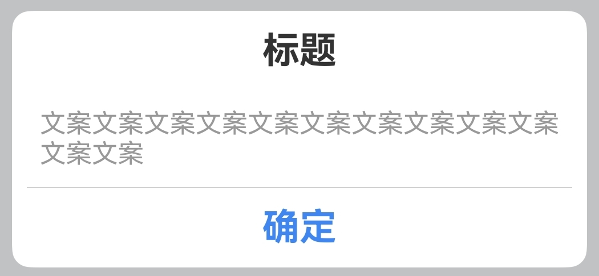

# 对话框Dialog

## 一、效果总览

 
 

## 二、描述

通用弹出对话框，分为头部标题区、内容区、和底部按键区三个区域，支持使用args定制内容和样式，也支持传入builder自定义。
支持函数调用和组件调用两种方式。

## 三、构造函数及参数说明

```text
// 组件调用
OmniCustomDialog({
  titleBuilder?: VoidCallback,
  contentBuilder?: VoidCallback,
  buttonBuilder?: (controller?: OmniDialogController) => void,
  titleArgs?: OmniDialogTextArgs,
  contentArgs?: OmniDialogTextArgs,
  leftButtonArgs?: OmniDialogButtonArgs,
  rightButtonArgs?: OmniDialogButtonArgs,
  onLeftButtonClick?: (event: ClickEvent) => void,
  onRightButtonClick?: (event: ClickEvent) => void,
  dialogBorder?: BorderOptions,
  dialogBgColor?: ResourceColor,
  dialogDivider?: OmniDialogDividerOptions,
})

// 函数调用
let dialog = new OmniDialog(uiContext: UIContext)
// 打开dialog
dialog.show(args: OmniDialogArgs)
// 关闭dialog
dialog.dismiss()

export interface OmniDialogArgs {
  titleBuilder?: () => void
  contentBuilder?: () => void
  buttonBuilder?: (controller?: OmniDialogController) => void
  titleArgs?: OmniDialogTextArgs
  contentArgs?: OmniDialogTextArgs
  leftButtonArgs?: OmniDialogButtonArgs
  rightButtonArgs?: OmniDialogButtonArgs
  onLeftButtonClick?: (event: ClickEvent) => void
  onRightButtonClick?: (event: ClickEvent) => void
  dialogBorder?: BorderOptions
  dialogBgColor?: ResourceColor
  dialogDivider?: OmniDialogDividerOptions
  isModal?: boolean
  showInSubWindow?: boolean
  autoCancel?: boolean
  alignment?: DialogAlignment
  offset?: Offset
  transition?: TransitionEffect
  maskColor?: ResourceColor
  onDidAppear?: VoidCallback
  onDidDisappear?: VoidCallback
}

interface OmniDialogTextArgs {
  value: string
  style?: OmniDialogFontStyle
  padding?: Padding | Length | LocalizedPadding
}

interface OmniDialogFontStyle {
  font?: Font
  color?: ResourceColor
}

export interface OmniDialogButtonArgs {
  value: string
  fontStyle?: OmniDialogFontStyle
  padding?: Padding | Length | LocalizedPadding
  backgroundColor?: ResourceColor
  border?: BorderOptions
}

export interface OmniDialogDividerOptions {
  strokeWidth?: number | string
  color?: ResourceColor
  margin?: Margin | Length | LocalizedMargin
}
```

### OmniDialogArgs

| 参数名                | 类型                                        | 必填 | 说明                                                              |
|:-------------------|:------------------------------------------|:---|:----------------------------------------------------------------|
| titleBuilder       | VoidCallback                              | 否  | 标题区域的builder函数                                                  |
| contentBuilder     | VoidCallback                              | 否  | 内容区域的builder函数                                                  |
| buttonBuilder      | (controller?: OmniDialogController) => void | 否  | 按键区域的builder函数，controller用于关闭dialog<br/>`controller?.dismiss()` |
| titleArgs          | OmniDialogTextArgs                          | 否  | 标题区内容及样式设置                                                      |
| contentArgs        | OmniDialogTextArgs                          | 否  | 内容区内容及样式设置                                                      |
| leftButtonArgs     | OmniDialogButtonArgs                        | 否  | 左边按键内容及样式设置                                                     |
| rightButtonArgs    | OmniDialogButtonArgs                        | 否  | 右边按键内容及样式设置                                                     |
| onLeftButtonClick  | (event: ClickEvent) => void               | 否  | 左边按键的点击回调                                                       |
| onRightButtonClick | (event: ClickEvent) => void               | 否  | 右边按键的点击回调                                                       |
| dialogBorder       | BorderOptions                             | 否  | 对话框的边框样式设置                                                      |
| dialogBgColor      | ResourceColor                             | 否  | 对话框的背板颜色设置                                                      |
| dialogDivider      | OmniDialogDividerOptions                    | 否  | 对话框中分割线样式设置                                                     |
| isModal            | boolean                                   | 否  | 弹窗是否为模态窗口                                                       |
| showInSubWindow    | boolean                                   | 否  | 某弹框需要显示在主窗口之外时，是否在子窗口显示此弹窗。                                     |
| autoCancel         | boolean                                   | 否  | 点击遮障层时，是否关闭弹窗                                                   |
| alignment          | DialogAlignment                           | 否  | 弹窗在竖直方向上的对齐方式                                                   |
| offset             | Offset                                    | 否  | 弹窗相对alignment所在位置的偏移量                                           |
| transition         | TransitionEffect                          | 否  | 弹窗显示和退出的过渡效果                                                    |
| maskColor          | ResourceColor                             | 否  | 蒙层颜色                                                            |
| onDidAppear        | VoidCallback                              | 否  | 弹窗弹出时的事件回调                                                      |
| onDidDisappear     | VoidCallback                              | 否  | 弹窗消失时的事件回调                                                      |

### OmniDialogTextArgs

| 参数名     | 类型                                    | 必填 | 说明     |
|:--------|:--------------------------------------|:---|:-------|
| value   | string                                | 是  | 文本内容   |
| style   | OmniDialogFontStyle                     | 否  | 文本字体样式 |
| padding | Padding \| Length \| LocalizedPadding | 否  | 文本内边距  |

### OmniDialogFontStyle

| 参数名   | 类型            | 必填 | 说明                          |
|:------|:--------------|:---|:----------------------------|
| font  | Font          | 否  | 设置文本样式，包括字体大小、字体粗细、字体族和字体风格 |
| color | ResourceColor | 否  | 设置文本字体颜色                    |

### OmniDialogButtonArgs

| 参数名             | 类型                                    | 必填 | 说明        |
|:----------------|:--------------------------------------|:---|:----------|
| value           | string                                | 是  | 设置按键的内容文本 |
| fontStyle       | OmniDialogFontStyle                     | 否  | 设置按键的文本样式 |
| padding         | Padding \| Length \| LocalizedPadding | 否  | 设置按键的内边距  |
| backgroundColor | ResourceColor                         | 否  | 设置按键的背景颜色 |
| border          | BorderOptions                         | 否  | 设置按键的边框样式 |

### OmniDialogDividerOptions

| 参数名         | 类型                                  | 必填 | 说明      |
|:------------|:------------------------------------|:---|:--------|
| strokeWidth | number \| string                    | 否  | 分割线的宽度  |
| color       | ResourceColor                       | 否  | 分割线的颜色  |
| margin      | Margin \| Length \| LocalizedMargin | 否  | 分割线的外边距 |

## 四、代码演示

### 示例一：单个按钮



```text
@Entry
@Component
struct DialogExample {
  private dialog: OmniDialog = new OmniDialog(this.getUIContext())
    
  build() {
    Column() {
      Button('单个按钮').onClick(() => {
            this.dialog.show({
              titleArgs: { value: '标题' },
              contentArgs: { value: '文案文案文案文案文案文案文案文案文案文案文案文案' },
              leftButtonArgs: { value: '确定', fontStyle: { color: 0x4086f1 } },
              onLeftButtonClick: () => {
                this.dialog.dismiss()
                OmniToast.showText({ msg: '点击确定' })
              },
              dialogDivider: { margin: { left: 8, right: 8 } }
            })
          })
    }
  }  
}
```

### 示例二：两个按钮


```text
@Entry
@Component
struct DialogExample {
  private dialog: OmniDialog = new OmniDialog(this.getUIContext())
    
  build() {
    Column() {
      Button('两个按钮').onClick(() => {
            this.dialog.show({
              titleArgs: { value: '标题' },
              contentArgs: { value: '这是正文内容' },
              leftButtonArgs: { value: '取消', fontStyle: { color: 0x303030 } },
              onLeftButtonClick: () => {
                this.dialog.dismiss()
                OmniToast.showText({ msg: '点击取消' })
              },
              rightButtonArgs: {
                value: '确定',
                fontStyle: { color: Color.White, font: { weight: FontWeight.Bold, size: 20 } },
                backgroundColor: 0x3b82f1,
                border: { radius: { bottomRight: 10 } }
              },
              onRightButtonClick: () => {
                this.dialog.dismiss()
                OmniToast.showText({ msg: '点击确定' })
              }
            })
          })
    }
  }  
}
```

### 示例三：自定义标题


```text
@Entry
@Component
struct DialogExample {
  private dialog: OmniDialog = new OmniDialog(this.getUIContext())
    
  build() {
    Column() {
      Button('自定义标题').onClick(() => {
            this.dialog.show({
              titleBuilder: myTitleBuilder,
              contentArgs: { value: '文案文案文案文案文案文案文案文案文案文案文案文案' },
              rightButtonArgs: {
                value: '我知道了',
                fontStyle: { color: 0x4086f1 },
              },
              onRightButtonClick: () => {
                this.dialog.dismiss()
                OmniToast.showText({ msg: '点击我知道了' })
              }
            })
          })
    }
  }  
}

@Builder
function myTitleBuilder() {
  Row() {
    Image('https://pic4.58cdn.com.cn/nowater/frs/n_v3d872cbc54d6d4c6ba1a2112513928d7c.png')
      .size({ width: 30, height: 30 })
    Text('这是标题')
      .font({
        weight: FontWeight.Bold,
        size: 20
      })
      .fontColor(0xFF333333)
      .padding(10)
    Image('https://pic4.58cdn.com.cn/nowater/frs/n_v3d872cbc54d6d4c6ba1a2112513928d7c.png')
      .size({ width: 30, height: 30 })
  }.alignItems(VerticalAlign.Center)
  .justifyContent(FlexAlign.Center)
}
```

### 示例四：自定义内容


```text
@Entry
@Component
struct DialogExample {
  private dialog: OmniDialog = new OmniDialog(this.getUIContext())
    
  build() {
    Column() {
      Button('自定义内容').onClick(() => {
            this.dialog.show({
              titleArgs: { value: '标题标题标题hello这是标题' },
              rightButtonArgs: {
                value: '我知道了',
                fontStyle: { color: 0x4086f1 },
              },
              onRightButtonClick: () => {
                this.dialog.dismiss()
                OmniToast.showText({ msg: '点击我知道了' })
              },
              contentBuilder: this.myContentBuilder,
            })
          })
    }
  } 
  
  @Builder
  myContentBuilder() {
    Column({ space: 10 }) {
      Text('多行内容')
      Text('这是第二行')
        .backgroundColor(0xeb4e27)
      Text('这是第三行')
    }.width('80%')
    .backgroundColor(0x5abe43)
    .borderRadius(6)
  } 
}
```

### 示例五：自定义按钮


```text
@Entry
@Component
struct DialogExample {
  private dialog: OmniDialog = new OmniDialog(this.getUIContext())
    
  build() {
    Column() {
      Button('自定义按钮').onClick(() => {
            this.dialog.show({
              titleArgs: { value: '标题标题标题hello这是标题' },
              contentArgs: { value: '这是内容这是内容这是内容这是内容这是内容这是内容这是内容这是内容这是内容' },
              buttonBuilder: myButtonBuilder,
            })
          })
    }
  }  
}

@Builder
function myButtonBuilder(controller?: OmniDialogController) {
  Column() {
    Divider()
      .vertical(false)
      .strokeWidth(0.5)
      .color(0x99999999)
    Text('选项一')
      .textAlign(TextAlign.Center)
      .fontColor(0xFF333333)
      .fontSize(20)
      .padding(10)
      .onClick(() => {
        controller?.dismiss()
        OmniToast.showText({ msg: '点击了选项一' })
      })
      .width('100%')
    Divider()
      .vertical(false)
      .strokeWidth(0.5)
      .color(0x99999999)
    Text('选项二')
      .textAlign(TextAlign.Center)
      .fontColor(0xFF333333)
      .fontSize(20)
      .padding(10)
      .onClick(() => {
        controller?.dismiss()
        OmniToast.showText({ msg: '点击了选项二' })
      })
      .width('100%')
    Divider()
      .vertical(false)
      .strokeWidth(0.5)
      .color(0x99999999)
    Text('选项三')
      .textAlign(TextAlign.Center)
      .fontColor(0xFF333333)
      .fontSize(20)
      .padding(10)
      .onClick(() => {
        controller?.dismiss()
        OmniToast.showText({ msg: '点击了选项三' })
      })
      .width('100%')
  }
}
```

### 示例六：组件调用

```text
@Entry
@Component
struct DialogExample {
    
  build() {
    Column() {
      OmniCustomDialog({
            titleArgs: { value: '组件调用方式' },
            contentArgs: {
              value: '组件调用方式组件调用方式组件调用方式'
            },
            dialogBorder: { width: 2, radius: 6, color: 0x333333 },
            rightButtonArgs: {
              value: '我知道了',
              fontStyle: { color: 0x4086f1 },
            },
          })
    }
  }  
}
```