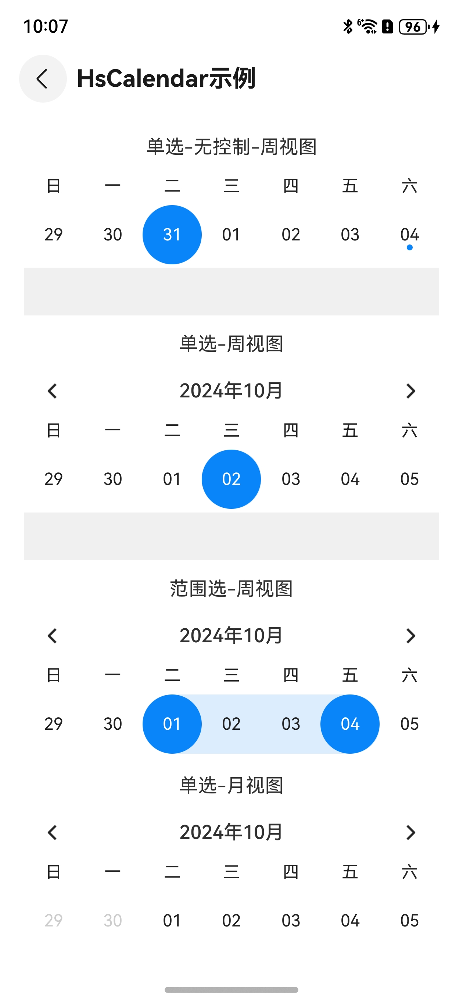
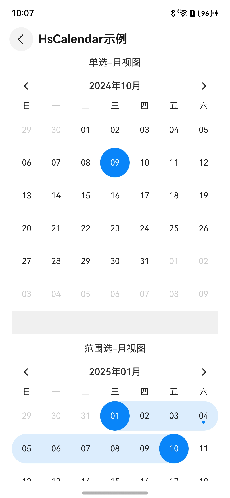

# 日历Calendar

## 一、效果总览

<div style="display: flex; gap: 30px; justify-content: flex-start;">
 
 
</div>

## 二、描述

- 日历组件，支持周视图和月视图。


- 日期选择支持时间点选择和时间范围选择。

## 三、构造函数及参数说明

### OmniCalendar

| 参数名               | 参数类型                               | 描述                          | 是否必填 | 默认值      |
|-------------------|------------------------------------|-----------------------------|------|----------|
| displayMode       | DisplayMode                        | 展示模式，周视图：week，月视图：month     | 否    | month    |
| selectMode        | SelectMode                         | 选择模式，单点选择：single，范围选择：range | 否    | single   |
| showControllerBar | boolean                            | 是否展示切换日期按钮                  | 否    | 是        |
| initDisplayDate   | Date                               | 初始展示月份                      | 否    | 当前时间所在月份 |
| minDate           | Date                               | 最小展示时间                      | 否    | 1970     |
| maxDate           | Date                               | 最大展示时间                      | 否    | 2100     |
| dateChange        | (date: Date) => void               | 选中日期的回调-单点选择                | 否    | 无        |
| rangeDateChange   | (range: CalendarRangeDate) => void | 选中日期的回调-范围选择                | 否    | 无        |

## 四、代码演示

```typescript
Text('单选-无控制-周视图')
  .padding({ bottom: 15 })
OmniCalendar({
  displayMode: DisplayMode.week,
  showControllerBar: false,
  dateChange: (date) => {
    Toast.showText({ msg: `选中的时间： ${this._formatDate(date)}` })
  },
})

Divider()
  .vertical(false)
  .strokeWidth(40)
  .color('#F0F0F0')

Text('单选-周视图')
  .padding({ top: 15, bottom: 15 })
OmniCalendar({
  displayMode: DisplayMode.week,
  initDisplayDate: new Date(Date.parse('2024-10-01')),
  minDate: new Date(2024, 0, 1),
  maxDate: new Date(2025, 11, 31),
  dateChange: (date) => {
    Toast.showText({ msg: `选中的时间： ${this._formatDate(date)}` })
  },
})

Divider()
  .vertical(false)
  .strokeWidth(40)
  .color('#F0F0F0')

Text('范围选-周视图')
  .padding({ top: 15, bottom: 15 })
OmniCalendar({
  displayMode: DisplayMode.week,
  selectMode: SelectMode.range,
  initDisplayDate: new Date(Date.parse('2024-10-01')),
  minDate: new Date(2024, 0, 1),
  maxDate: new Date(2025, 11, 31),
  rangeDateChange: (rangeDate) => {
    Toast.showText({
      msg: `开始时间： ${this._formatDate(rangeDate.start)} , 结束时间：${this._formatDate(rangeDate.end)}`
    })
  }
})

Text('单选-月视图')
  .padding({ top: 15, bottom: 15 })
OmniCalendar({
  displayMode: DisplayMode.month,
  initDisplayDate: new Date(Date.parse('2024-10-01')),
  minDate: new Date(2024, 0, 1),
  maxDate: new Date(2025, 11, 31),
  dateChange: (date) => {
    Toast.showText({ msg: `选中的时间： ${this._formatDate(date)}` })
  },
})

Divider()
  .vertical(false)
  .strokeWidth(40)
  .color('#F0F0F0')

Text('范围选-月视图')
  .padding({ top: 15, bottom: 15 })
OmniCalendar({
  displayMode: DisplayMode.month,
  selectMode: SelectMode.range,
  minDate: new Date(2024, 0, 1),
  maxDate: new Date(2025, 11, 31),
  rangeDateChange: (rangeDate) => {
    Date
    Toast.showText({
      msg: `开始时间： ${this._formatDate(rangeDate.start)} , 结束时间：${this._formatDate(rangeDate.end)}`
    })
  }
})
```