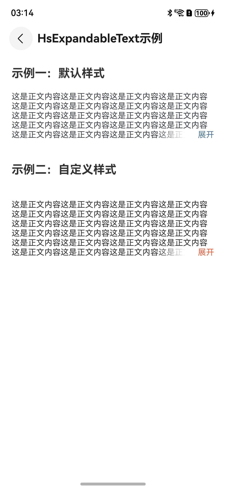
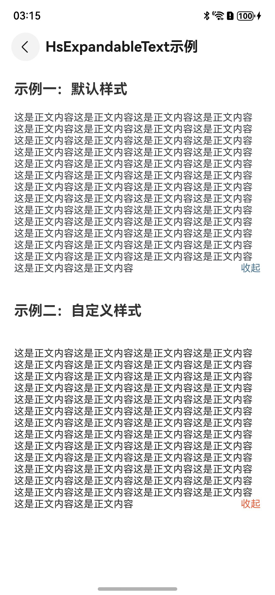

# 可折叠文本ExpandableText

## 一、效果总览

<div style="display: flex; gap: 30px; justify-content: flex-start;">
 
 
</div>

## 二、描述

可折叠/展开的文本框，支持自定义文本样式

## 三、构造函数及参数说明

```text
OmniExpandableText({
  isFold: boolean,
  content: string,
  maxLine: number,
  contentFontColor: ResourceColor,
  contentFontSize: string | number | Resource,
  expandFontColor: ResourceColor,
  expandFontSize: string | number | Resource,
  foldText: ResourceStr,
  expandText: ResourceStr
  })
```

| 参数名              | 类型                           | 必填 | 说明                        |
|:-----------------|:-----------------------------|:---|:--------------------------|
| isFold           | boolean                      | 否  | 是否折叠文本，默认为true            |
| content          | string                       | 否  | 文本内容                      |
| maxLine          | number                       | 否  | 折叠后展示的最大行数                |
| contentFontColor | ResourceColor                | 否  | 文本字体颜色，默认为#43474D         |
| contentFontSize  | string \| number \| Resource | 否  | 文本字体大小，默认为14fp            |
| expandFontColor  | ResourceColor                | 否  | 右下角'展开'文本的字体颜色，默认为#517A99 |
| expandFontSize   | string \| number \| Resource | 否  | 右下角'展开'文本的字体大小，默认为14fp    |
| foldText         | ResourceStr                  | 否  | 收起文案                      |
| expandText       | ResourceStr                  | 否  | 展开文案                      |


## 四、代码演示

### 示例一：默认效果

```text
@Entry
@Component
struct ExpandableTextExample {
  @State content: string =
    '这是正文内容这是正文内容这是正文内容这是正文内容这是正文内容这是正文内容这是正文内容这是正文内容这是正文内容这是正文内容这是正文内容这是正文内容这是正文内容这是正文内容这是正文内容这是正文内容这是正文内容这是正文内容' +
      '这是正文内容这是正文内容这是正文内容这是正文内容这是正文内容这是正文内容这是正文内容这是正文内容这是正文内容这是正文内容这是正文内容这是正文内容' +
      '这是正文内容这是正文内容这是正文内容这是正文内容这是正文内容这是正文内容这是正文内容这是正文内容这是正文内容这是正文内容这是正文内容这是正文内容这是正文内容' +
      '这是正文内容这是正文内容这是正文内容这是正文内容这是正文内容这是正文内容这是正文内容这是正文内容这是正文内容这是正文内容这是正文内容'

  build() {
    NavDestination() {
      Column({ space: 10 }) {
        Text('示例一：默认样式')
            .fontSize(20)
            .fontWeight(FontWeight.Bold)
            .fontColor(0x333333)
            .padding({
              top: 20,
              bottom: 20,
              right: 20,
              left: 20
            })
            .width('100%')
          OmniExpandableText({
            content: this.content,
            maxLine: 5,
          }).margin(
            {
              left: 20,
              right: 20,
              bottom: 20
            }
          )
      }
      .alignItems(HorizontalAlign.Center)
      .width('100%')
    }
    .title('ExpandableText示例')
  }
}
```

### 示例二：自定义样式

```text
@Entry
@Component
struct ExpandableTextExample {
  @State content: string =
    '这是正文内容这是正文内容这是正文内容这是正文内容这是正文内容这是正文内容这是正文内容这是正文内容这是正文内容这是正文内容这是正文内容这是正文内容这是正文内容这是正文内容这是正文内容这是正文内容这是正文内容这是正文内容' +
      '这是正文内容这是正文内容这是正文内容这是正文内容这是正文内容这是正文内容这是正文内容这是正文内容这是正文内容这是正文内容这是正文内容这是正文内容' +
      '这是正文内容这是正文内容这是正文内容这是正文内容这是正文内容这是正文内容这是正文内容这是正文内容这是正文内容这是正文内容这是正文内容这是正文内容这是正文内容' +
      '这是正文内容这是正文内容这是正文内容这是正文内容这是正文内容这是正文内容这是正文内容这是正文内容这是正文内容这是正文内容这是正文内容'

  build() {
    NavDestination() {
      Column({ space: 10 }) {
        Text('示例二：自定义样式')
            .fontSize(20)
            .fontWeight(FontWeight.Bold)
            .fontColor(0x333333)
            .padding({
              top: 20,
              bottom: 20,
              right: 20,
              left: 20
            })
            .width('100%')
          OmniExpandableText({
            content: this.content,
            maxLine: 6,
            contentFontColor: 0x333333,
            expandFontColor: 0xec623e
          })
            .margin({
              top: 20,
              bottom: 20,
              right: 20,
              left: 20
            })
      }
      .alignItems(HorizontalAlign.Center)
      .width('100%')
    }
    .title('ExpandableText示例')
  }
}
```