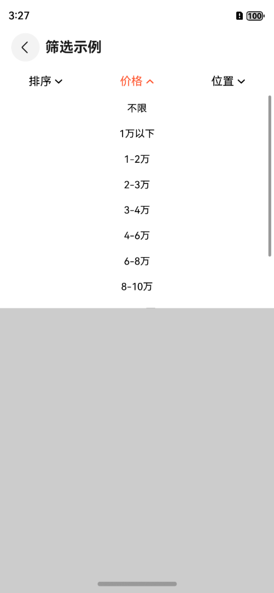
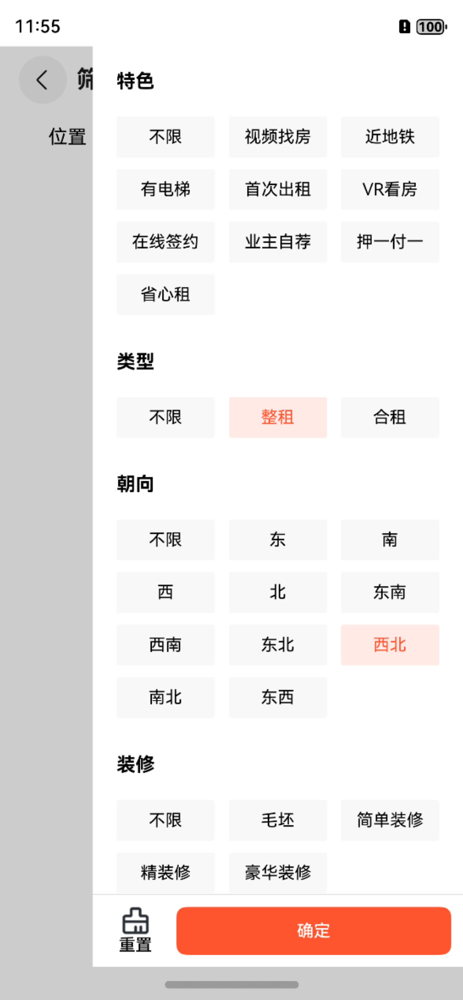
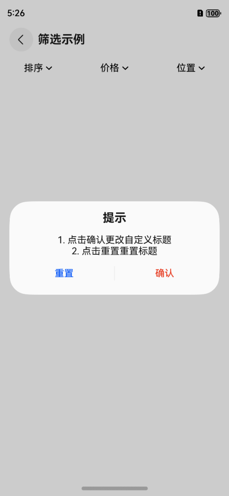

# 筛选OmniFilterBar

## 一、效果总览


<div style="display: flex; flex-wrap: wrap; gap: 2rem;">
  
  
  
</div>

## 二、描述

支持下拉和侧滑弹窗的筛选组件，筛选组件是移动端应用中常见的交互形式，用于帮助用户从大量数据中快速筛选出符合需求的内容

目前筛选组件支持三种通用的显示类型

* 多级列表（下拉）：支持1-3级数据的单选、多选的下拉列表
* 网格样式（下拉）：支持2级数据的网格样式下拉列表
* 更多样式（侧滑）：支持2级数据的网格样式侧滑列表

### 1. 基础数据结构

筛选组件的数据结构是一个树形结构，每个节点都可以包含以下字段：

| 字段名          | 描述                                         | 生效层级                                       |
|--------------|--------------------------------------------|--------------------------------------------|
| title        | 筛选项的标题，表示筛选条件的名称。                          | 全层级，在root层级为menu标题，其他层级时根据不同的showType有不同含义 |
| key          | 筛选键值，用于唯一标识筛选项，在请求或过滤逻辑中使用。                | 当有children时生效                              |
| type         | 筛选项的类型，如 radio（单选）、checkbox（多选）等。          | 全层级                                        |
| showType     | 筛选项的显示方式，如 dropList（下拉列表）、dropGrid（下拉网格）等。 | root层级                                     |
| value        | 筛选项的当前值，表示用户选择的具体条件。                       | 非root层级                                    |
| defaultValue | 筛选项的默认值，当用户未选择时，使用的默认筛选条件。                 | 当有children时生效                              |
| children     | 子筛选项数组，用于构建层级结构，表示该筛选项的细化条件或子分类。           | 非根层级                                       |

### 2. 规则说明

筛选组件支持父子层级结构，通过 children 字段实现嵌套筛选。
父节点负责显示一级筛选条件，子节点用于表示细化的二级或多级筛选条件。例如，一个价格筛选可以通过父子层级实现“价格范围”到具体区间的筛选。


```json
{
  "title": "价格",
  "key": "price",
  "type": "radio",
  "showType": "dropList",
  "value": "",
  "defaultValue": "",
  "children": [
    {
      "title": "不限",
      "key": "",
      "type": "unlimit",
      "defaultValue": "",
      "value": ""
    },
    {
      "title": "1万以下",
      "key": "",
      "type": "radio",
      "defaultValue": "",
      "value": "0-1"
    },
    {
      "title": "1-2万",
      "key": "",
      "type": "radio",
      "defaultValue": "",
      "value": "1-2"
    },
    {
      "title": "2-3万",
      "key": "",
      "type": "radio",
      "defaultValue": "",
      "value": "2-3"
    },
    {
      "title": "3-4万",
      "key": "",
      "type": "radio",
      "defaultValue": "",
      "value": "3-4"
    },
    {
      "title": "4-6万",
      "key": "",
      "type": "radio",
      "defaultValue": "",
      "value": "4-6"
    },
    {
      "title": "6-8万",
      "key": "",
      "type": "radio",
      "defaultValue": "",
      "value": "6-8"
    },
    {
      "title": "8-10万",
      "key": "",
      "type": "radio",
      "defaultValue": "",
      "value": "8-10"
    }
  ]
}
```

#### 2.1 一级筛选条件

一级筛选项作为最外层的分类条件，例如 “区域” “价格” “房型” 等，直接展示在筛选组件的主界面。通过 title 和 key 标识，并使用
type 确定其单选或者多选交互方式。

#### 2.2 多级筛选条件

当一级筛选项需要细化时，可以在 children 中添加子筛选项。例如，价格的二级筛选可以细分为多个区间。每个子筛选项也需要自定义自己的
type 类型，用于决定与其同级 children 的交互方式。

#### 2.3 选中类型 type

type 决定了筛选项的选择行为，共有以下三种类型：

1. radio（单选）：
    * 用户只能从当前筛选项中选择一个值。
    * 适用于彼此互斥的筛选条件，例如“房型”中的“一室”“两室”“三室”等。
2. checkbox（多选）：
    * 用户可以从当前筛选项中选择多个值。
    * 适用于可组合的筛选条件，例如“特色”中的“视频找房”“有电梯”“押一付一”等。
3. unlimit（不限）：
    * 表示当前筛选项没有特定的限制条件，等同于“全选”或“不筛选”。
    * 通常作为筛选项的默认选中值，例如“朝向”的默认选项“不限”。

#### 2.4 交互方式 showType

内置的showType有三种，分别是

* dropList 筛选项会以下拉列表菜单的形式显示，支持1-3级列表项，也即数据结构最大深度为3
* dropGrid 筛选项会以下拉网格菜单的形式显示，支持2级，也即数据结构需要保持深度为2
* more 筛选项会以侧滑网格菜单的形式显示，支持2级，也即数据结构需要保持深度为2

筛选组件扩展了自定义交互方式的api，具体请见第四部分代码演示

#### 2.5 默认值与用户选择

* defaultValue 表示初始状态，需要为 children 中存在的value。
* 用户操作后，value 字段会更新为用户选择的具体值。

## 三、构造函数及参数说明

```typescript
@Component
export struct OmniFilterBar {
   //筛选数据
   @ObjectLink filterData: OmniFilterDataList
   //组件控制器
   filterController?: OmniFilterController = undefined
   //筛选参数变更回调
   onFilterParamsChanged?: (selectedParams: Map<string, string>) => void
   //数据转换代理
   filterConverterDelegate: OmniFilterConverterDelegate = new DefaultFilterConverter()
   //点击menu的拦截
   onMenuClickInterceptor?: (index: number, item: OmniFilterItemBean) => boolean
   //menu title的自定义设置
   onMenuCustomTitle?: (index: number, item: OmniFilterItemBean) => OmniFilterCustomMenuTitle | undefined
   //组件注册器
   componentRegistry: OmniFilterComponentRegistry = new OmniFilterComponentRegistry()
   //样式设置
   @Provide filterStyle: OmniFilterStyle = {}
...
```
### OmniFilterBar

| 参数名                     | 参数类型                                                               | 描述               | 是否必填 | 默认值                       |
|-------------------------|--------------------------------------------------------------------|------------------|------|---------------------------|
| filterData              | OmniFilterDataRoot                                                   | 筛选数据结构包装类        | 是    | 无                         |
| filterController      | OmniFilterController                                                 | 组件控制器            | 否    | undefined                 |
| onFilterParamsChanged   | (selectedParams: Map<string, string>)                              | 筛选参数变更回调         | 否    | undefined                 |
| filterConverterDelegate | OmniFilterConverterDelegate                                          | 数据转换代理           | 否    | DefaultFilterConverter    |
| onMenuClickInterceptor  | (index: number, item: OmniFilterItemBean) => boolean                 | 点击menu的拦截        | 否    | undefined                 |
| onMenuCustomTitle       | (index: number, item: OmniFilterItemBean) => OmniFilterCustomMenuTitle | menu title的自定义设置 | 否    | undefined                 |
| componentRegistry       | OmniFilterComponentRegistry                                          | 组件注册器            | 否    | OmniFilterComponentRegistry |
| filterStyle             | OmniFilterStyle                                                      | 样式设置             | 否    | 空对象                       |


## 四、代码演示

### 1. 常规使用

一般使用有如下步骤
1. 解析或构造 `OmniFilterDataRoot`
2. 声明筛选组件 `OmniFilterBar`
   * 传入筛选数据 `filterDataRoot`
   * 可通过 `onFilterParamsChanged` 获取参数变更回调
   * 可通过传入 `filterController` 来控制筛选弹窗的消失和菜单 Menu 的刷新
3. 使用选中参数处理业务逻辑
4. 使用 `filterController` 控制器手动关闭筛选弹窗

```typescript
@Entry
@Component
struct FilterBarExamplePage {
   //筛选数据
   @State filterDataRoot?: OmniFilterDataRoot = undefined
   //选中参数
   @State selectedParams?: Map<string, string> = undefined
   //筛选控制器
   private filterController: OmniFilterController = new OmniFilterController()

   aboutToAppear(): void {
      //1. 解析或构造OmniFilterDataRoot
      getContext(this).resourceManager.getRawFileContent('more_filter.json', (_err, value) => {
         let textDecoder = util.TextDecoder.create('utf-8', { ignoreBOM: true });
         const result = textDecoder.decodeWithStream(value, { stream: false })
         this.filterDataRoot = new OmniFilterDataRoot(OmniFilterItemBean.convertJsonToObj(result)!) 
      });
   }

   build() {
      NavDestination() {
         Column() {
            //2. 声明筛选组件 OmniFilterBar
            //传入筛选数据 filterDataRoot
            //可通过 onFilterParamsChanged 获取参数变更回调
            //可通过传入 filterController 来控制筛选弹窗的消失和菜单Menu的刷新
            if (this.filterDataRoot) {
               OmniFilterBar(
                  {
                     filterDataRoot: this.filterDataRoot,
                     onFilterParamsChanged: (selectedParams: Map<string, string>) => {
                        this.selectedParams = selectedParams
                     },
                     filterController: this.filterController,
                  }
               )
            }
            //3. 使用选中参数处理业务逻辑
            if (this.selectedParams) {
               Flex() {
                  Column() {
                     Text(`${JSON.stringify(ObjectUtil.ObjectFromEntries(this.selectedParams))}`)
                  }
                  .width(`100%`)
                  .height(`100%`)
                  .justifyContent(FlexAlign.Center)
                  .alignItems(HorizontalAlign.Center)
               }
            }
         }
         .height('100%')
            .width('100%')
      }
      .title('筛选示例')
      .onWillDisappear(() => {
        //4. 使用filterController控制器手动关闭筛选弹窗
        this.filterController.close()
      })
   }

}
```


### 2. 内置的筛选弹窗类型（共三种）

内置的三种弹窗类型在使用时用showType来区分


#### 2.1 dropList 多级列表（下拉）
支持1-3级数据的单选、多选的下拉列表


详见
> entry/src/main/ets/pages/filterbar/OmniFilterBarMultiListExamplePage.ets


#### 2.2 dropGrid 网格样式（下拉）
支持2级数据的网格样式下拉列表


详见
> entry/src/main/ets/pages/filterbar/OmniFilterBarMultiGridExamplePage.ets

#### 2.3 more 更多样式（侧滑）
支持2级数据的网格样式侧滑列表


详见
> entry/src/main/ets/pages/filterbar/OmniFilterBarMoreExamplePage.ets


### 3. 自定义筛选数据数据转换器

筛选数据的转换支持使用者自定义
1. 实现`OmniFilterConverterDelegate`接口，重写`convertSelectedData`函数，入参是筛选数据结构，返回值为 `onFilterParamsChanged` 的传入参数
2. 在构造 `OmniFilterBar` 时将自定义 `OmniFilterConverterDelegate` 传入

```typescript
// 自定义筛选项数据转换器
export class CustomFilterConverter implements OmniFilterConverterDelegate {
  constructor() {
  }

  convertSelectedData(selectedResults: OmniFilterItemBean[]): Map<string, string> {
    //TODO 自定义转换逻辑，返回类型为 Map<string, string> 的通用格式
  }
}
```

### 4. 自定义下拉/侧滑组件内容

自定义下拉/侧滑弹窗的内容需要先创建并配置自定义的组件注册器 `OmniFilterComponentRegistry`

将自定义的视图以 `WrappedBuilder` 的形式注册到 `OmniFilterComponentRegistry` 中，`builder` 函数接收如下参数


| 参数名             | 参数类型             | 描述                                                        | 是否必填 |
|-----------------|------------------|-----------------------------------------------------------|------|
| item            | OmniFilterItemBean | 筛选数据                                                      | 是    |                    
| onConfirmAction | OnConfirmAction  | 确定筛选的Action回调，调用后组件的筛选参数变更回调 `onFilterParamsChanged` 将会工作 | 是    |
| onCloseAction   | OnCloseAction    | 筛选参数变更回调                                                  | 否    |

```typescript
private customComponentRegistry: OmniFilterComponentRegistry = new OmniFilterComponentRegistry()

  aboutToAppear(): void {
    ......
    //注册自定义Component
    this.customComponentRegistry.registerDropSlideComponent(`custom_value`, wrapBuilder(customLayout))
  }


@Builder
function customLayout(item: OmniFilterItemBean, onConfirmAction: OnConfirmAction, onCloseAction: OnCloseAction) {
  OmniFilterCustomValueRange({
    item: item,
    onConfirmAction: onConfirmAction
  })
}
```

在声明 `OmniFilterBar` 将注册器传入

```typescript
OmniFilterBar(
   {
      componentRegistry: this.customComponentRegistry
   }
)
```

**注意**：自定义组件需要在调用 `onConfirmAction` 前自行处理好筛选数据的选中状态，具体可见demo中的自定义类型示例
> entry/src/main/ets/pages/filterbar/OmniFilterBarCustomExamplePage.ets


### 5. 自定义Menu

OmniFilterBar 提供了 onMenuClickInterceptor 和 onMenuCustomTitle 回调，允许开发者拦截菜单点击事件以及自定义菜单标题。

#### 5.1 onMenuClickInterceptor
在 OmniFilterBar 组件中，可以通过 onMenuClickInterceptor 拦截菜单项的点击事件，例如：
* 拦截特定索引的菜单项
* 弹出提示框
* 执行自定义逻辑

```typescript
OmniFilterBar({
  filterDataRoot: this.filterDataRoot,
  filterController: this.filterController,
  onMenuClickInterceptor: (index: number, item: OmniFilterItemBean) => {
    this.currentInterceptItem = item
    if (index == 0) {
      OmniToast.showText({ msg: `拦截 index = ${index}` })
      return true // 拦截该菜单项，阻止默认行为
    }
    if (index == 1) {
      this.dialogControllerConfirm.open() // 弹出自定义对话框
      return true
    }
    return false // 允许默认行为
  }
})
```

| 参数    | 类型               | 作用                   |
|-------|------------------|----------------------|
| index | number           | 当前点击的菜单索引            |                
| item  | OmniFilterItemBean | 该索引对应的筛选项            |
| 返回值   | boolean          | true：拦截，false：允许默认行为 | 


<div style="display: flex; flex-wrap: wrap; gap: 2rem;">
  
  
</div>

#### 5.2 onMenuCustomTitle

可以通过 onMenuCustomTitle 自定义菜单项的显示标题。例如：
* 根据选中项改变标题
* 设置自定义标题
* 根据不同索引项设置不同标题

```typescript
OmniFilterBar({
  onMenuCustomTitle: (index: number, item: OmniFilterItemBean) => {
    if (index == 1) {
      if (item.customMap && item.customMap.has(`custom_selected_title`)) {
        return new OmniFilterCustomMenuTitle(item.customMap.get(`custom_selected_title`)!.toString(), true)
      }
    }
    if (index == 2) {
      if (item.selectedListWithoutUnlimit().length > 0) {
        return new OmniFilterCustomMenuTitle(`自定义3`, true)
      }
    }
    return undefined
  }
})
```


| 参数    | 类型                                   | 作用                        |
|-------|--------------------------------------|---------------------------|
| index | number                               | 当前菜单索引                    |                
| item  | OmniFilterItemBean                     | 当前筛选项                     |
| 返回值   | OmniFilterCustomMenuTitle or undefined | 自定义标题对象，undefined 则使用默认标题 | 

#### 5.3 更新菜单项状态

如果菜单项的标题依赖于筛选状态，可以调用 filterController.refreshMenu() 进行刷新，例如：
```typescript
if (this.currentInterceptItem) {
  this.currentInterceptItem.customMap = new Map()
  this.currentInterceptItem.customMap.set(`custom_selected_title`, `自定义标题`)
  this.filterController.refreshMenu()
}
```

这样可以动态更新菜单项的标题，确保 UI 状态正确。

具体可见demo中的自定义Menu示例
> entry/src/main/ets/pages/filterbar/OmniFilterBarMenuCustomExamplePage.ets

### 6. 自定义样式

```typescript
OmniFilterBar(
   {
      filterDataRoot: this.filterDataRoot,
      onFilterParamsChanged: (selectedParams: Map<string, string>) => {
         this.selectedParams = selectedParams
      },
      filterController: this.filterController,
      filterStyle: {
         menuStyle: {
            menuSelectedTextStyle: {
               fontColor: Color.Blue,
               fontWeight: FontWeight.Bold
            }
         },
         listStyle: {
            itemSelectedTextStyle: {
               fontColor: Color.Blue,
               fontSize: 16,
               fontWeight: FontWeight.Bold
            },
         },
         gridStyle: {
            titleTextStyle: {
               fontColor: Color.Red,
               fontSize: 20,
            },
            itemSelectedTextStyle: {
               fontColor: Color.Blue,
               fontWeight: FontWeight.Bold
            },
            itemSelectedBgColor: OmniThemeUtil.colorWithOpacity(Color.Blue, 0.3)
         },
         bottomPanelStyle: {
            resetText: `Reset`,
            resetIcon: $r('app.media.icon_filter_reset_custom'),
            confirmText: `OK`,
            confirmButtonColor: Color.Blue
         }
      }
   }
)
```

<div style="display: flex; flex-wrap: wrap; gap: 2rem;">
  
</div>

具体可见demo中的自定义样式示例
> entry/src/main/ets/pages/filterbar/OmniFilterBarStyleCustomExamplePage.ets

**1. OmniFilterStyle**

| 参数名                | 类型                         | 描述     | 是否必填 |
|--------------------|----------------------------|--------|------|
| `menuStyle`        | `OmniFilterMenuStyle`        | 菜单样式   | 否    |
| `gridStyle`        | `OmniFilterGridStyle`        | 网格样式   | 否    |
| `listStyle`        | `OmniFilterListStyle`        | 列表样式   | 否    |
| `bottomPanelStyle` | `OmniFilterBottomPanelStyle` | 底部面板样式 | 否    |

---

**2. OmniFilterMenuStyle（菜单样式）**

| 参数名                     | 类型                  | 描述       | 是否必填 |
|-------------------------|---------------------|----------|------|
| `menuTextStyle`         | `OmniFilterTextStyle` | 菜单文字常规样式 | 否    |
| `menuSelectedTextStyle` | `OmniFilterTextStyle` | 菜单文字选中样式 | 否    |

---

**3. OmniFilterListStyle（列表样式）**

| 参数名                             | 类型                  | 描述           | 是否必填 |
|---------------------------------|---------------------|--------------|------|
| `maxHeight`                     | `number`            | 列表最大高度       | 否    |
| `itemTextStyle`                 | `OmniFilterTextStyle` | 列表文字常规样式     | 否    |
| `itemSelectedTextStyle`         | `OmniFilterTextStyle` | 列表文字选中样式     | 否    |
| `itemMultiSelectIconUnselected` | `OmniFilterIcon`      | 多选 icon（未选中） | 否    |
| `itemMultiSelectIconSelected`   | `OmniFilterIcon`      | 多选 icon（选中）  | 否    |

---

**4. OmniFilterGridStyle（网格样式）**

| 参数名                     | 类型                  | 描述            | 是否必填 |
|-------------------------|---------------------|---------------|------|
| `maxHeight`             | `number`            | 网格最大高度        | 否    |
| `rowCount`              | `number`            | 每行显示的 item 数量 | 否    |
| `titleTextStyle`        | `OmniFilterTextStyle` | 网格标题样式        | 否    |
| `itemTextStyle`         | `OmniFilterTextStyle` | 网格文字常规样式      | 否    |
| `itemSelectedTextStyle` | `OmniFilterTextStyle` | 网格文字选中样式      | 否    |
| `itemBgColor`           | `OmniResourceColor`   | item 背景色      | 否    |
| `itemSelectedBgColor`   | `OmniResourceColor`   | item 背景色（选中）  | 否    |

---

**5. OmniFilterBottomPanelStyle（底部面板样式）**

| 参数名                  | 类型                  | 描述     | 是否必填 |
|----------------------|---------------------|--------|------|
| `resetText`          | `string`            | 重置按钮文本 | 否    |
| `resetTextStyle`     | `OmniFilterTextStyle` | 重置文字样式 | 否    |
| `resetIcon`          | `OmniFilterIcon`      | 重置图标   | 否    |
| `confirmText`        | `string`            | 确定按钮文本 | 否    |
| `confirmTextStyle`   | `OmniFilterTextStyle` | 确定文字样式 | 否    |
| `confirmButtonColor` | `OmniResourceColor`   | 确定按钮颜色 | 否    |
