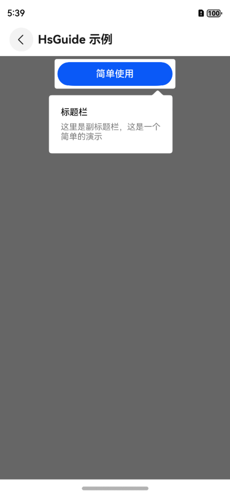

# 引导Guide

## 一、效果总览

<div style="display: flex; gap: 30px; justify-content: flex-start;">
 
 
 
</div>

## 二、描述

适用于页面功能引导。

## 三、构造函数及参数说明

### OmniGuide

| 参数名     | 参数类型                             | 描述                             | 是否必填 | 默认值 |
|---------|----------------------------------|--------------------------------|------|-----|
| content | CustomBuilder                    | 引导页组件的蒙版覆盖的内容                  | 是    | 无   |
| builder | OmniGuideBuilder                   | 引导页的通用配置                       | 是    | 无   |
| onReady | (controller: Controller) => void | 回调通知引导页组件即将显示，可获取Controller控制器 | 否    | 是   |

### OmniGuideBuilder

| 参数名                        | 参数类型                   | 描述           | 是否必填 | 默认值   |
|----------------------------|------------------------|--------------|------|-------|
| label                      | string                 | 引导页名称        | 是    | 无     |
| alwaysShowGuide            | boolean                | 是否总是显示引导页    | 否    | false |
| guidePages                 | GuidePage[]            | 引导页页面集合      | 是    | 无     |
| visibleStateChangeListener | OnGuideChangedListener | 引导页面显示状态变化监听 | 否    | 无     |
| pageChangedListener        | OnPageChangedListener  | 引导页面页数切换监听   | 否    | 无     |

### GuidePage

| 参数名                  | 参数类型            | 描述             | 是否必填 | 默认值       |
|----------------------|-----------------|----------------|------|-----------|
| highLights           | HighLight[]     | 高亮组件/区域集合      | 是    | 无         |
| highLightIndicator   | CustomBuilder   | 高亮指示层(页面级)     | 否    | null      |
| bubbleIndicator      | BubbleIndicator | 气泡指示器          | 否    | null      |
| enterAnimation       | AnimatorOptions | 导页进入动画         | 否    | null      |
| exitAnimation        | AnimatorOptions | 引导页退出动画        | 否    | null      |
| backgroundColor      | string          | 引导页蒙版背景色       | 否    | #99000000 |
| everywhereCancelable | boolean         | 是否点击任意位置切换到下一页 | 否    | true      |

### BubbleIndicator

| 参数名            | 参数类型           | 描述         | 是否必填 | 默认值                   |
|----------------|----------------|------------|------|-----------------------|
| componentId    | string         | 被绑定的高亮组件ID | 是    | 无                     |
| bubblePosition | BubblePosition | 气泡指示器的展示方向 | 否    | BubblePosition.BOTTOM |
| bubbleBean     | BubbleBean     | 气泡指示器的内容   | 是    | 无                     |

## 四、代码演示

```typescript
aboutToAppear()
{
  this.builder = new OmniGuideBuilder()
    .setLabel('OmniGuideMultiPageExample')
    .alwaysShow(true)// 总是显示，调试时可以打开
    .setOnGuideChangedListener(this.visibleChangeListener)
    .setOnPageChangedListener(this.pageChangeListener)
    .addGuidePage(GuidePage.newInstance()
      .addHighLight('OmniTag')
      .setBubbleIndicator(
        new BubbleIndicator(
          'OmniTag',
          new BubbleBean('OmniTag内容标题', '这是一个标签示例，气泡说明在内容下方'),
          BubblePosition.BOTTOM
        )
      )
      .setEnterAnimation(this.enterAnimatorParam)
      .setExitAnimation(this.exitAnimatorParam)
    )
    .addGuidePage(GuidePage.newInstance()
      .addHighLight('Button1')
      .setBubbleIndicator(
        new BubbleIndicator(
          'Button1',
          new BubbleBean('左边的按钮标题', '这是一个左边的按钮示例，气泡说明在内容下方'),
          BubblePosition.BOTTOM
        )
      )
      .setEnterAnimation(this.enterAnimatorParam)
      .setExitAnimation(this.exitAnimatorParam)
    )
    .addGuidePage(GuidePage.newInstance()
      .addHighLight('Button2')
      .setBubbleIndicator(
        new BubbleIndicator(
          'Button2',
          new BubbleBean('右边的按钮标题', '这是一个右边的按钮示例，气泡说明在内容下方'),
          BubblePosition.BOTTOM
        )
      )
      .setEnterAnimation(this.enterAnimatorParam)
      .setExitAnimation(this.exitAnimatorParam)
    )
    .addGuidePage(GuidePage.newInstance()
      .addHighLight('TextLeft')
      .setBubbleIndicator(
        new BubbleIndicator(
          'TextLeft',
          new BubbleBean('左边的内容标题', '这是一个左边的内容示例，气泡说明在内容右方'),
          BubblePosition.RIGHT
        )
      )
      .setEnterAnimation(this.enterAnimatorParam)
      .setExitAnimation(this.exitAnimatorParam)
    )
    .addGuidePage(GuidePage.newInstance()
      .addHighLight('TextRight')
      .setBubbleIndicator(
        new BubbleIndicator(
          'TextRight',
          new BubbleBean('右边的内容标题', '这是一个左边的内容示例，气泡说明在内容左方'),
          BubblePosition.LEFT
        )
      )
      .setEnterAnimation(this.enterAnimatorParam)
      .setExitAnimation(this.exitAnimatorParam)
    )
    .addGuidePage(GuidePage.newInstance()
      .addHighLight('ButtonBottom')
      .setBubbleIndicator(
        new BubbleIndicator(
          'ButtonBottom',
          new BubbleBean('底部的内容标题', '这是一个底部的内容示例，气泡说明在内容上方'),
          BubblePosition.TOP
        )
      )
      .setEnterAnimation(this.enterAnimatorParam)
      .setExitAnimation(this.exitAnimatorParam)
    )
}

...

OmniGuide({
  content: this.content,
  builder: this.builder,
  onReady: (controllerParam: Controller) => {
    this.controller = controllerParam
    setTimeout(() => {
      this.controller?.show()
    }, 300)
  }
})

```
