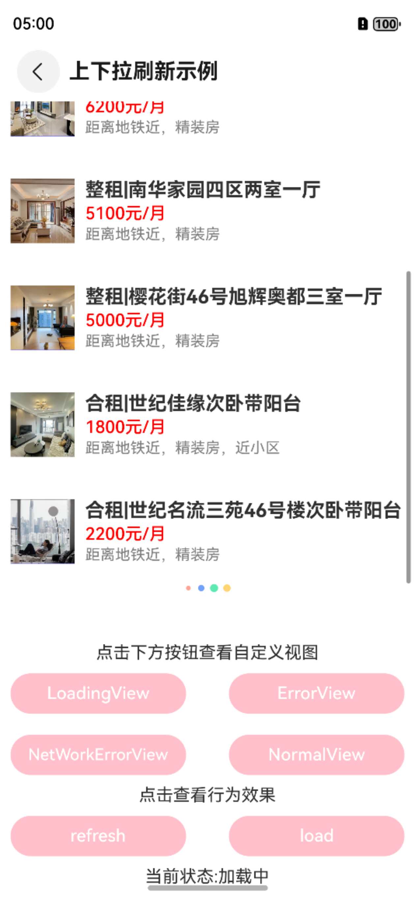
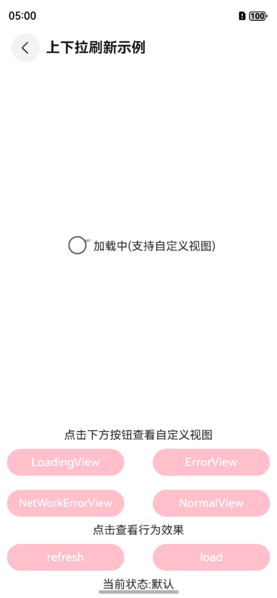

# 上下拉刷新PullToRefresh

## 一、效果总览

<div style="display: flex; justify-content: space-between;">
 


</div>


## 二、描述
- 支持上下拉刷新， 无数据侵入。


- 支持任意组件的嵌套，支持任意布局(List,Grid,Web,Scroll,Text,Row,Column)等布局


- 支持自定义异常页面loading页面等。


- 支持主动调用进入上下拉状态

## 三、构造函数及参数说明

### OmniPullToRefreshLayout

| 参数名            | 参数类型                             | 描述               | 是否必填 | 默认值  |
|----------------|----------------------------------|------------------|------|------|
| config         | OmniRefreshLayoutConfig            | 上下拉配置项           | 是    | 无    |
| controller     | OmniPullableController             | 用于控制和获取上下拉控制器的状态 | 是    | 无    |
| scroller       | Scroller                         | 内容视图的引用          | 是    | 无    |
| onRefresh      | () => void                       | 下拉刷新的回调          | 否    | null |
| onPullListener | (OmniPullDown: OmniPullDown) => void | 上下拉加载状态监听        | 否    | null |
| contentView    | () => void                       | 设置内容视图           | 是    | null |
| viewLoading    | () => void                       | 加载中自定义视图         | 否    | null |
| viewEmpty      | () => void                       | 空数据自定义视图         | 否    | null |
| viewError      | () => void                       | 数据错误自定义视图        | 否    | null |
| viewNoNetwork  | () => void                       | 网络异常自定义视图        | 否    | null |

### OmniPullableController

| 参数名            | 参数类型                        | 描述                            | 是否必填 | 默认值  |
|----------------|-----------------------------|-------------------------------|------|------|
| refreshSuccess | () => void                  | 下拉刷新成功，当数据处理完成后需要根据数据情况调用该方法  | 是    | null |
| loadSuccess    | (hasMore?: boolean) => void | 下拉刷新成功， 当数据处理完成后需要根据数据情况调用该方法 | 否    | null |
| viewLoading    | () => void                  | 当需要展示自定义loadingView时调用该方法     | 否    | null |
| viewEmpty      | () => void                  | 当需要展示自定义emptyView时调用该方法       | 否    | null |
| viewError      | () => void                  | 当需要展示自定义errowView时调用该方法       | 否    | null |
| refresh        | () => void                  | 手动触发下拉刷新                      | 否    | null |
| load           | () => void                  | 手动触发上拉加载                      | 否    | null |

### OmniRefreshLayoutConfig

| 参数名                   | 参数类型   | 描述       | 是否必填 | 默认值   |
|-----------------------|--------|----------|------|-------|
| pullRefreshEnable     | bool   | 是否开启下拉刷新 | 否    | true  |
| loadMoreEnable        | bool   | 是否开启上拉加载 | 否    | false |
| pullMaxDistance       | number | 下拉最大距离   | 否    | 500   |
| pullRefreshResistance | number | 下拉阻力     | 否    | 0.5   |
| pullLoadMaxDistance   | number | 上拉最大距离   | 否    | 500   |
| pullLoadResistance    | number | 上拉阻力     | 否    | 0.5   |

### OmniPullStatus

| 枚举值            | 含义      |
|----------------|---------|
| DEF            | 默认状态    |
| PullDown       | 正在下拉    |
| PreRefresh     | 达到可下拉状态 |
| Refresh        | 刷新中     |
| RefreshSuccess | 刷新成功    |
| RefreshError   | 刷新失败    |
| PullUp         | 正在加载    |
| PreLoad        | 达到可加载状态 |
| Load           | 加载中     |
| LoadSuccess    | 加载成功    |
| LoadError      | 加载失败    |


## 四、代码演示

```typescript
public controller: OmniPullableController = new OmniPullableController()
private config: OmniRefreshLayoutConfig = new OmniRefreshLayoutConfig();
scroller: Scroller = new Scroller()
  
  OmniPullToRefreshLayout({
  scroller: this.scroller,
  config: this.config,
  controller: this.controller,
  viewError: () => {
    // 自定义数据异常视图
  },
  viewEmpty: () => {
    // 自定义无数据视图
  },
  viewNoNetwork: () => {
    // 自定义网络异常视图
  },
  viewLoading: () => {
   // 自定义加载态视图
  },
  contentView: () => {
    this.contentView()
  },
  onRefresh: () => {
   // 下拉刷新回调， 执行数据操作
    this.controller.refreshSuccess()
  },
  onLoad: () => {
    // 上拉加载回调， 执行数据操作
    this.controller.loadSuccess(false)
  },
  onPullListener: (pullDown) => {
    // 获取上下拉状态监听
  },
}).width("100%").height("70%").clip(true)

@Builder
contentView() {
  List({ scroller: this.scroller }) {
   // 省略自定义视图代码
  }.width("100%").height("100%")
    .edgeEffect(EdgeEffect.None)
}
```
