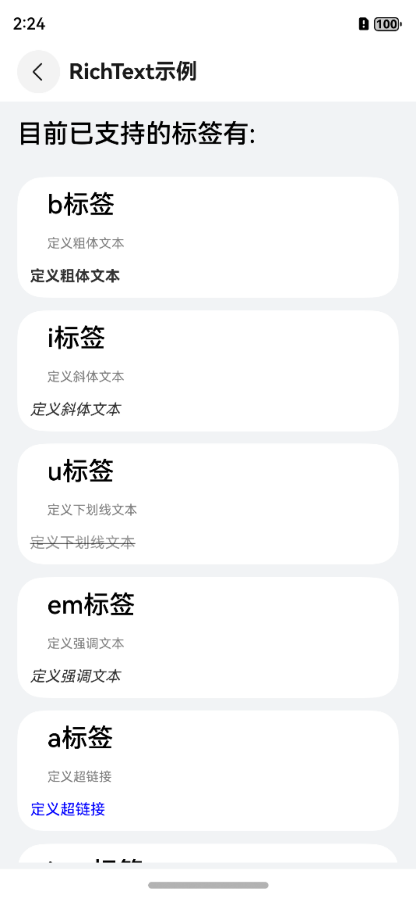
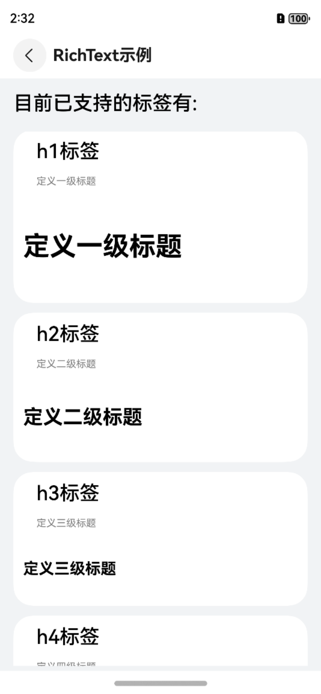
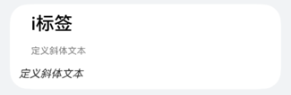
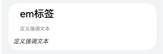
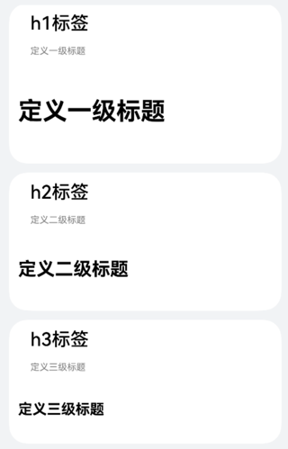

# 富文本RichText

## 一、效果总览
<div style="display: flex; justify-content: space-between;">
 
 
 
 
</div>

## 二、描述

支持展示带html标签的文本

## 三、构造函数及参数说明

```typescript
OmniRichText({
  htmlStr:string,
  onHyperLinkClickListener?: (url: string) => void
})
```

| 参数名                      | 参数类型                  | 描述      | 是否必填 | 默认值 |
|--------------------------|-----------------------|---------|------|-----|
| htmlStr                  | string                | 富文本字符串  | 是    | 无   |
| onHyperLinkClickListener | (url: string) => void | a标签点击逻辑 | 否    |     |

## 四、代码演示

### 默认效果

```typescript
OmniRichText({
  htmlStr: item.tagExample
})
```

### 粗体文本


```typescript
OmniRichText({
  htmlStr: '<b>定义粗体文本</b>'
})
```

### 斜体文本


```typescript
OmniRichText({
  htmlStr: '<i>定义斜体文本</i>'
})
```
### 下划线文本


```typescript
OmniRichText({
  htmlStr: '<u>定义下划线文本</u>'
})
```
### 强调文本


```typescript
OmniRichText({
  htmlStr: '<em>定义强调文本</em>'
})
```
### 超链接


```typescript
OmniRichText({
  htmlStr: '<a href="https://www.baidu.com" target="_blank">定义超链接</a>',
  onHyperLinkClickListener: (url: string) => {
    OmniToast.showText({ msg: `click:${url}` })
  }
})
```
### 图片


```typescript
OmniRichText({
  htmlStr: '定义图片</img>'
})
```
### 块级元素


```typescript
OmniRichText({
  htmlStr: '<div style="font-weight: bold;font-style: italic;font-size: 16px;color: rgba(255, 0, 255, 1);">定义一个块级元素</div>'
})
```
### 段落


```typescript
OmniRichText({
  htmlStr: '<p>定义一个段落</p>'
})
```
### 标题



```typescript
OmniRichText({
  htmlStr: '<h1>定义一级标题</h1>'
})

OmniRichText({
  htmlStr: '<h2>定义二级标题</h2>'
})

OmniRichText({
  htmlStr: '<h3>定义三级标题</h3>'
})

OmniRichText({
  htmlStr: '<h4>定义四级标题</h4>'
})

OmniRichText({
  htmlStr: '<h5>定义五级标题</h5>'
})

OmniRichText({
  htmlStr: '<h6>定义六级标题</h6>'
})
```