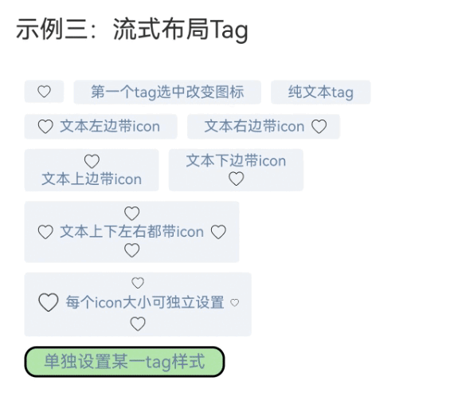
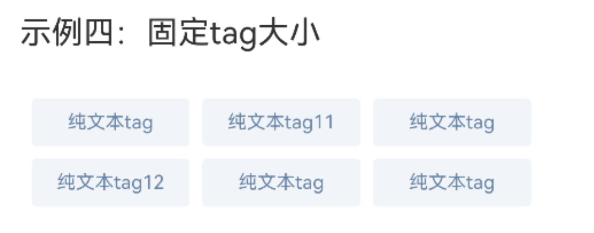

# 标签Tag

## 一、效果总览


## 二、描述

1. 支持设置文本及文本上下左右图标
2. 支持水平滑动和流式两种布局
3. 支持自定义tags样式
4. 支持onItemClick处理tag的点击回调
5. 支持感应tagItems数据变化（支持感应数组本身的赋值和添加、删除、更新数组，以及数组项属性的变化）

## 三、构造函数及参数说明

```text
OmniTag({
  tagItems: TagItemInfo[],
  selectable?: boolean,
  isSelectedBold?: boolean,
  mode?: TagMode,
  horizontalSpace?: number | string,
  flexSpace?: FlexSpaceOptions,
  style?: TagStyle,
  onItemClick?: (tagItemInfo: TagItemInfo, index: number)=>void
})

class TagItemInfo {
  title?: string
  icons?: IconInfo
  tagStyle?: TagStyle
  isSelected: boolean
}

interface IconInfo {
  top?: IconItemInfo,
  bottom?: IconItemInfo,
  left?: IconItemInfo,
  right?: IconItemInfo
}

interface IconItemInfo {
  icon?: PixelMap | ResourceStr | DrawableDescriptor
  iconSize?: SizeOptions
}

interface TagStyle {
  textMargin?: Margin | Length | LocalizedMargin
  fontSize?: string | number | Resource
  fontColor?: ResourceColor
  backgroundColor?: ResourceColor
  selectedFontSize?: string | number | Resource
  selectedBackgroundColor?: ResourceColor
  selectedFontColor?: ResourceColor
  itemBorder?: BorderOptions
  selectedItemBorder?: BorderOptions
  itemPadding?: Padding | Length | LocalizedPadding
  itemSize?: SizeOptions
}

enum TagMode {
  HORIZONTAL_SCROLL,
  FLEX
}
```

| 参数名             | 类型                                                | 必填 | 说明               |
|:----------------|:--------------------------------------------------|:---|:-----------------|
| tagItems        | TagItemInfo[]                                     | 是  | 展示的标签列表          |
| selectable      | boolean                                           | 否  | 是否可选中，默认可选中      |
| isSelectedBold  | boolean                                           | 否  | 选中后字体是否加粗，默认不加粗  |
| mode            | TagMode                                           | 否  | tag布局类型，默认水平滑动布局 |
| horizontalSpace | number \| string                                  | 否  | 水平滑动布局中tag的间距    |
| flexSpace       | FlexSpaceOptions                                  | 否  | 流式布局中tag的间距      |
| style           | TagStyle                                          | 否  | tag的全局样式         |
| onItemSelected  | (tagItemInfo: TagItemInfo, index: number) => void | 否  | 选中回调             |

### TagItemInfo

| 参数名        | 类型       | 必填 | 说明             |
|:-----------|:---------|:---|:---------------|
| title      | string   | 否  | 标签文本           |
| icons      | IconInfo | 否  | 标签中文本前后左右的icon |
| tagStyle   | TagStyle | 否  | 当前tag的样式       |
| isSelected | boolean  | 否  | 当前tag的选中状态     |

### IconInfo

| 参数名    | 类型           | 必填 | 说明           |
|:-------|:-------------|:---|:-------------|
| top    | IconItemInfo | 否  | 标签内位于文本上边的图标 |
| bottom | IconItemInfo | 否  | 标签内位于文本下边的图标 |
| left   | IconItemInfo | 否  | 标签内位于文本左边的图标 |
| right  | IconItemInfo | 否  | 标签内位于文本右边的图标 |

### IconItemInfo

| 参数名      | 类型                                            | 必填 | 说明                 |
|:---------|:----------------------------------------------|:---|:-------------------|
| icon     | PixelMap \| ResourceStr \| DrawableDescriptor | 否  | 图片的数据源，支持本地图片和网络图片 |
| iconSize | SizeOptions                                   | 否  | 图片的大小              |

### TagStyle

| 参数名                     | 类型                                  | 必填 | 说明          |
|:------------------------|:------------------------------------|:---|:------------|
| textMargin              | Margin \| Length \| LocalizedMargin | 否  | 文本的外间距      |
| fontSize                | string \| number \| Resource        | 否  | 文本的字体大小     |
| selectedFontSize        | string \| number \| Resource        | 否  | 选中文本的字体大小   |
| fontColor               | ResourceColor                       | 否  | 文本的字体颜色     |
| selectedFontColor       | ResourceColor                       | 否  | 选中文本的字体颜色   |
| backgroundColor         | ResourceColor                       | 否  | tag的背景颜色    |
| selectedBackgroundColor | ResourceColor                       | 否  | tag选中时的背景颜色 |
| itemBorder              | BorderOptions                       | 否  | tag的边框样式    |
| selectedItemBorder      | BorderOptions                       | 否  | tag选中时的边框样式 |
| itemPadding             | Padding\| Length\| LocalizedPadding | 否  | tag的内边距     |
| itemSize                | SizeOptions                         | 否  | tag的尺寸      |

### TagMode

| 参数名               | 描述     |
|:------------------|:-------|
| HORIZONTAL_SCROLL | 水平滑动布局 |
| FLEX              | 流式布局   |

## 四、代码演示

### 示例一：水平滑动布局Tag


```text
@Entry
@Component
struct TagExample {
  @State tagItems: TagItemInfo[] = [
    new TagItemInfo({
      icons: {
        left: {
          icon: $r('app.media.tag_heart'),
          iconSize: { width: 13, height: 13 }
        },
      },
    }),
    new TagItemInfo({ title: '第一个tag选中改变图标' }),
    new TagItemInfo({ title: '纯文本tag' }),
    new TagItemInfo({
      title: '文本左边带icon',
      icons: {
        left: { icon: $r('app.media.tag_heart') }
      }
    }),
    new TagItemInfo({
      title: '文本右边带icon',
      icons: {
        right: { icon: $r('app.media.tag_heart') }
      }
    }),
    new TagItemInfo({
      title: '文本上边带icon',
      icons: {
        top: { icon: $r('app.media.tag_heart') }
      }
    }),
    new TagItemInfo({
      title: '文本下边带icon',
      icons: {
        bottom: { icon: $r('app.media.tag_heart') }
      }
    }),
    new TagItemInfo({
      title: '文本上下左右都带icon',
      icons: {
        left: { icon: $r('app.media.tag_heart') },
        right: { icon: $r('app.media.tag_heart') },
        top: { icon: $r('app.media.tag_heart') },
        bottom: { icon: $r('app.media.tag_heart') },
      }
    }),
    new TagItemInfo({
      title: '每个icon大小可独立设置',
      icons: {
        left: { icon: $r('app.media.tag_heart'), iconSize: { width: 20, height: 20 } },
        right: { icon: $r('app.media.tag_heart'), iconSize: { width: 8, height: 8 } },
        top: { icon: $r('app.media.tag_heart'), iconSize: { width: 12, height: 12 } },
        bottom: { icon: $r('app.media.tag_heart') },
      }
    }),
    new TagItemInfo({
      title: '单独设置某一tag样式',
      tagStyle: {
        backgroundColor: 0xb4e7ad,
        selectedBackgroundColor: 0x33ff552e,
        fontSize: 14,
        itemBorder: { width: 2, color: Color.Black, radius: 10 }
      },
    })]

  build() {
    Column() {
      Stack() {
            OmniTag({
              tagItems: this.tagItems,
              horizontalSpace: 10,
              style: {
                itemPadding: {
                  left: 12,
                  right: 12,
                  top: 7,
                  bottom: 7
                },
                backgroundColor: 0xF8F8F8,
                selectedBackgroundColor: 0xFFEFEB,
                itemBorder: { radius: 3 },
                fontColor: 0x333333,
                selectedFontColor: 0xff552e,
                fontSize: 12
              },
              onItemClick: (item: TagItemInfo, index: number) => {
                if (index == 0) {
                  let isSelected = item.isSelected
                  item.icons = {
                    left: {
                      icon: isSelected ? $r('app.media.tag_heart_fill') : $r('app.media.tag_heart'),
                      iconSize: { width: 13, height: 13 }
                    },
                  }
                }
              }
            }).margin({ left: 15 })
              .padding({ right: 20 })

            Rect({ width: 50, height: 50 })
              .fill(Color.Transparent)
              .enabled(false)
              .linearGradient({
                direction: GradientDirection.Left,
                colors: [['rgba(255, 255, 255, 1.0)', 0.0], ['rgba(255, 255, 255, 0.5)', 0.7],
                  ['rgba(255, 255, 255, 0.0)', 1.0]],
                repeating: false
              })
          }.alignContent(Alignment.End)
  }
}
```

### 示例二：水平滑动布局Tag-不可点击


```text
@Entry
@Component
struct TagExample {
@State tagItems: TagItemInfo[] = [
    new TagItemInfo({
      icons: {
        left: {
          icon: $r('app.media.tag_heart'),
          iconSize: { width: 13, height: 13 }
        },
      },
    }),
    new TagItemInfo({ title: '第一个tag选中改变图标' }),
    new TagItemInfo({ title: '纯文本tag' }),
    new TagItemInfo({
      title: '文本左边带icon',
      icons: {
        left: { icon: $r('app.media.tag_heart') }
      }
    }),
    new TagItemInfo({
      title: '文本右边带icon',
      icons: {
        right: { icon: $r('app.media.tag_heart') }
      }
    }),
    new TagItemInfo({
      title: '文本上边带icon',
      icons: {
        top: { icon: $r('app.media.tag_heart') }
      }
    }),
    new TagItemInfo({
      title: '文本下边带icon',
      icons: {
        bottom: { icon: $r('app.media.tag_heart') }
      }
    }),
    new TagItemInfo({
      title: '文本上下左右都带icon',
      icons: {
        left: { icon: $r('app.media.tag_heart') },
        right: { icon: $r('app.media.tag_heart') },
        top: { icon: $r('app.media.tag_heart') },
        bottom: { icon: $r('app.media.tag_heart') },
      }
    }),
    new TagItemInfo({
      title: '每个icon大小可独立设置',
      icons: {
        left: { icon: $r('app.media.tag_heart'), iconSize: { width: 20, height: 20 } },
        right: { icon: $r('app.media.tag_heart'), iconSize: { width: 8, height: 8 } },
        top: { icon: $r('app.media.tag_heart'), iconSize: { width: 12, height: 12 } },
        bottom: { icon: $r('app.media.tag_heart') },
      }
    }),
    new TagItemInfo({
      title: '单独设置某一tag样式',
      tagStyle: {
        backgroundColor: 0xb4e7ad,
        selectedBackgroundColor: 0x33ff552e,
        fontSize: 14,
        itemBorder: { width: 2, color: Color.Black, radius: 10 }
      },
    })]

  build() {
    Column() {
      OmniTag({
            tagItems: this.tagItems,
            selectable: false,
            style: {
              fontSize: 12,
              textMargin: { top: 8, bottom: 8 },
              backgroundColor: 0xF8F8F8,
              fontColor: 0x1F2326,
              itemPadding: {
                left: 10,
                right: 10,
                top: 8,
                bottom: 8
              }
            }
          })
            .margin({
              top: 15,
              bottom: 20,
            })
    }
    .justifyContent(FlexAlign.Center)
  }
}
```

### 示例三：流式布局Tag



```text
@Entry
@Component
struct TagExample {
@State tagItems: TagItemInfo[] = [
    new TagItemInfo({
      icons: {
        left: {
          icon: $r('app.media.tag_heart'),
          iconSize: { width: 13, height: 13 }
        },
      },
    }),
    new TagItemInfo({ title: '第一个tag选中改变图标' }),
    new TagItemInfo({ title: '纯文本tag' }),
    new TagItemInfo({
      title: '文本左边带icon',
      icons: {
        left: { icon: $r('app.media.tag_heart') }
      }
    }),
    new TagItemInfo({
      title: '文本右边带icon',
      icons: {
        right: { icon: $r('app.media.tag_heart') }
      }
    }),
    new TagItemInfo({
      title: '文本上边带icon',
      icons: {
        top: { icon: $r('app.media.tag_heart') }
      }
    }),
    new TagItemInfo({
      title: '文本下边带icon',
      icons: {
        bottom: { icon: $r('app.media.tag_heart') }
      }
    }),
    new TagItemInfo({
      title: '文本上下左右都带icon',
      icons: {
        left: { icon: $r('app.media.tag_heart') },
        right: { icon: $r('app.media.tag_heart') },
        top: { icon: $r('app.media.tag_heart') },
        bottom: { icon: $r('app.media.tag_heart') },
      }
    }),
    new TagItemInfo({
      title: '每个icon大小可独立设置',
      icons: {
        left: { icon: $r('app.media.tag_heart'), iconSize: { width: 20, height: 20 } },
        right: { icon: $r('app.media.tag_heart'), iconSize: { width: 8, height: 8 } },
        top: { icon: $r('app.media.tag_heart'), iconSize: { width: 12, height: 12 } },
        bottom: { icon: $r('app.media.tag_heart') },
      }
    }),
    new TagItemInfo({
      title: '单独设置某一tag样式',
      tagStyle: {
        backgroundColor: 0xb4e7ad,
        selectedBackgroundColor: 0x33ff552e,
        fontSize: 14,
        itemBorder: { width: 2, color: Color.Black, radius: 10 }
      },
    })]

  build() {
    Column() {
      OmniTag({
            tagItems: this.tagItems,
            mode: TagMode.FLEX,
            style: {
              fontSize: 12,
              fontColor: 0x6884A5,
              textMargin: { left: 4, right: 4 },
              backgroundColor: 0x249DB8D7,
              itemBorder: { radius: 3 },
              itemPadding: {
                left: 10,
                right: 10,
                top: 3,
                bottom: 3
              },
            },
            flexSpace: { main: LengthMetrics.vp(8), cross: LengthMetrics.vp(8) }
          })
            .margin({
              left: 20,
              top: 10,
              right: 13,
              bottom: 8
            })
    }
  }
}
```


### 示例四：流式布局Tag-固定Tag大小



```text
@Entry
@Component
struct TagExample {
  @State tagItems: TagItemInfo[] = [
    new TagItemInfo({ title: '纯文本tag' }),
    new TagItemInfo({ title: '纯文本tag11' }),
    new TagItemInfo({ title: '纯文本tag' }),
    new TagItemInfo({ title: '纯文本tag12' }),
    new TagItemInfo({ title: '纯文本tag' }),
    new TagItemInfo({ title: '纯文本tag' }),
  ]

  build() {
    Column() {
      OmniTag({
            tagItems: this.tagItems,
            mode: TagMode.FLEX,
            style: {
              fontSize: 12,
              fontColor: 0x6884A5,
              backgroundColor: 0x249DB8D7,
              itemBorder: { radius: 3 },
              itemPadding: {
                left: 10,
                right: 10,
                top: 3,
                bottom: 3
              },
              itemSize: { width: 100, height: 30 }
            },
            flexSpace: { main: LengthMetrics.vp(8), cross: LengthMetrics.vp(8) }
          })
            .margin({
              left: 20,
              top: 10,
              right: 13,
              bottom: 8
            })
    }
  }
}
```