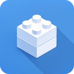

---
# https://vitepress.dev/reference/default-theme-home-page
layout: home

hero:
  name: "OmniUI鸿蒙组件库"
  text: "享受丝滑的开发体验"
  tagline: 58安居客-房产无线出品
  image:
    src: https://pic2.58cdn.com.cn/nowater/frs/n_v3c9bb1dd95ab948a18f81aa2af769bd73.png
    alt: VitePress
  actions:
    - theme: brand
      text: 组件概览
      link: /components/view/tag
    - theme: alt
      text: Github
      link: https://github.com/wuba/omni-ui
---

  

    
    <h3>25+ 组件</h3>
    
涵盖图表、视图、表单、操作反馈、导航5类 26 个组件 —— 覆盖常见开发场景。

    <a href="/omni-ui/components/view/tag" target="_blank">了解更多</a>
  

  

    
    <h3>主题定制</h3>
    
可配置主题色、字体、间距、圆角等通用属性，满足多样化视觉需求。

    <a href="/omni-ui/components/view/tag" target="_blank">了解更多</a>
  

  

    
    <h3>业务验证</h3>
    
应用于58安居客多个B/C端APP中，在实际业务场景中落地。

    <a href="/omni-ui/components/view/tag" target="_blank">了解更多</a>
  

